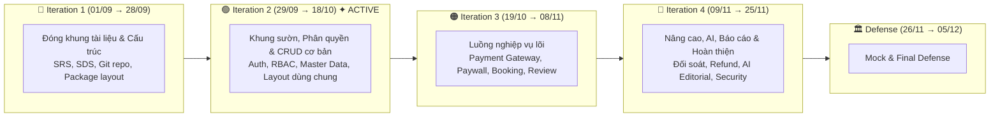
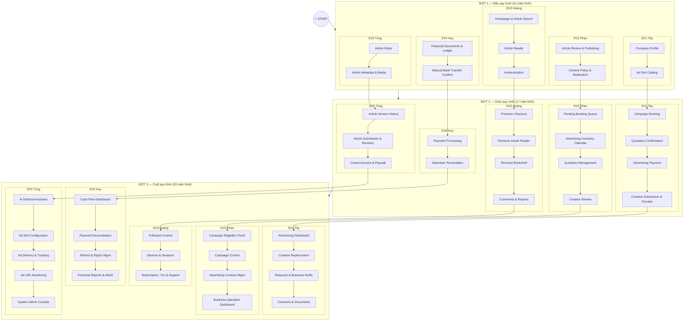
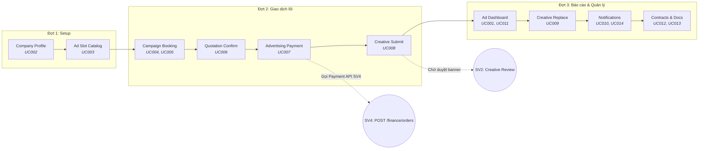
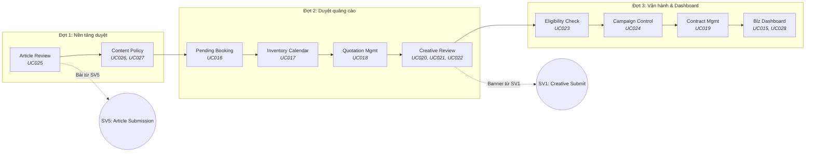
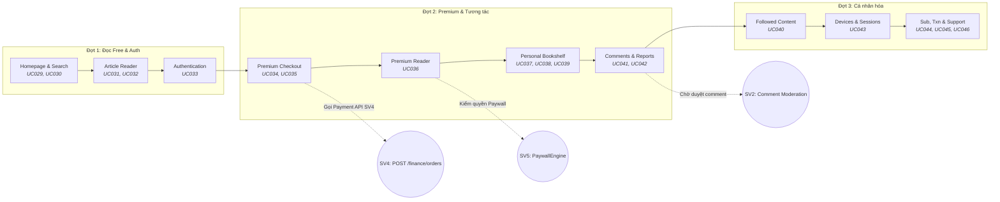
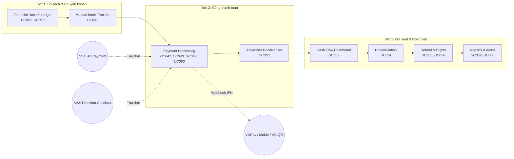
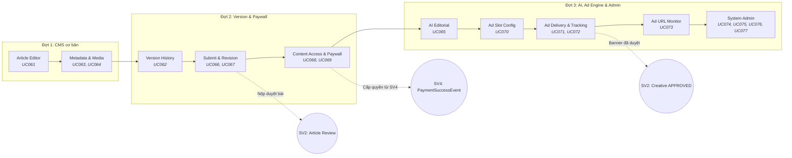
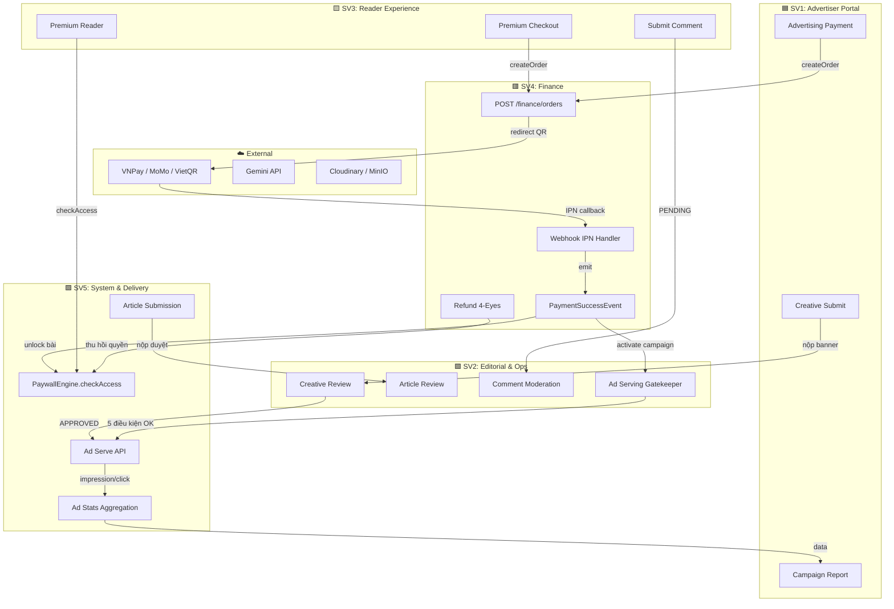

# 🗺️ LOCALPRESS — CODING PLAN (Graph Visualization)
> **Dự án:** LocalPress — Revenue & Trust Platform  
> **Nhóm:** 2 (Leader: Huy — SV4) | **Môn:** SWP391 — FALL 2026  
> **Tài liệu chuẩn:** `project_tracking_group2.xlsx`, `AGENTS.md`, `SYSTEM_CONTEXT_AND_ARCHITECTURE.md`  
> **Phương pháp:** AI-Driven SDLC — Graph-based Coding Plan

---

## 1. TỔNG QUAN LỘ TRÌNH 4 ITERATION (Master Timeline)

---

## 2. GRAPH TỔNG HỢP 5 NHÁNH MAIN FLOW × 3 ĐỢT MÀN HÌNH

> Mỗi nhánh (path) = 1 Main Flow do 1 thành viên làm chủ end-to-end.  
> Các nút = Màn hình/Phân hệ. Mũi tên = thứ tự triển khai theo Activity Flow.

---

## 3. NHÁNH CHI TIẾT TỪNG MAIN FLOW (Path per Flow)

### 3.1. PATH SV1 — Doanh nghiệp & Quảng cáo B2B (Tây)
> 14 Use Cases: `UC001` → `UC014` | 10 Màn hình | 25 Tiêu chí (16 P0, 9 P1)

### 3.2. PATH SV2 — Tòa soạn, Vận hành & Phê duyệt (Trọng Phan)
> 14 Use Cases: `UC015` → `UC028` | 10 Màn hình | 25 Tiêu chí (14 P0, 8 P1, 3 P2)

### 3.3. PATH SV3 — Khách & Độc giả (Hoàng)
> 18 Use Cases: `UC029` → `UC046` | 10 Màn hình | 25 Tiêu chí (18 P0, 6 P1, 1 P2)

### 3.4. PATH SV4 — Kế toán, Thanh toán & Đối soát (Huy — Leader)
> 14 Use Cases: `UC047` → `UC060` | 8 Màn hình | 25 Tiêu chí (12 P0, 12 P1, 1 P2)

### 3.5. PATH SV5 — Hệ thống, Paywall, Ad Serving & AI (Tùng)
> 17 Use Cases: `UC061` → `UC077` | 10 Màn hình | 25 Tiêu chí (17 P0, 7 P1, 1 P2)

---

## 4. GRAPH LIÊN KẾT GIỮA CÁC NHÁNH (Inter-Module Dependency Graph)

> Thể hiện các Shared Service Contracts & Cross-module Events.

---

## 5. BẢNG TỔNG HỢP: ITERATION × THÀNH VIÊN × USE CASES × MÀN HÌNH

| Đợt | SV1: Tây (Advertiser) | SV2: Phan (Editorial) | SV3: Hoàng (Reader) | SV4: Huy (Finance) | SV5: Tùng (System) |
|:---:|:---|:---|:---|:---|:---|
| **1** | Company Profile, Ad Slot Catalog | Article Review, Content Policy | Homepage, Article Reader, Auth | Financial Ledger, Bank Transfer | Article Editor, Metadata |
| **2** | Campaign Booking, Quotation, Payment, Creative | Booking Queue, Inventory, Quotation Mgmt, Creative Review | Checkout, Premium Reader, Bookshelf, Comments | Payment Processing, Receivables | Version History, Submit/Revise, Paywall |
| **3** | Dashboard, Creative Replace, Notifs, Contracts | Eligibility, Campaign Control, Contract Mgmt, Biz Dashboard | Followed, Devices, Sub/Txn/Support | Cash Flow, Reconciliation, Refund, Reports | AI, Ad Config, Ad Delivery, URL Monitor, Admin |
| **UCs** | UC001–UC014 (14) | UC015–UC028 (14) | UC029–UC046 (18) | UC047–UC060 (14) | UC061–UC077 (17) |
| **Screens** | 10 | 10 | 10 | 8 | 10 |
| **Criteria** | 25 (16P0, 9P1) | 25 (14P0, 8P1, 3P2) | 25 (18P0, 6P1, 1P2) | 25 (12P0, 12P1, 1P2) | 25 (17P0, 7P1, 1P2) |

---

## 6. TECH STACK & SHARED CONSTRAINTS

| Layer | Technology | Convention |
|:---|:---|:---|
| Frontend | Next.js 14 / React / TypeScript | PascalCase components, `useXxx` hooks, `xxxApi.ts` |
| State | Zustand | Shared auth/token state |
| Styling | TailwindCSS | Responsive, Dark Mode |
| Backend | Spring Boot 3 / Java 17 | Package: `com.localpress.*` |
| Security | JWT + Spring Security | 1 file `SecurityConfig.java` duy nhất (SV4 quản lý) |
| DB | MySQL 8.0 / utf8mb4 | Flyway migrations `V1__create_tables.sql` |
| Payment | VietQR / MoMo / VNPay Sandbox | Webhook HMAC SHA512, Idempotent |
| AI | Gemini API | Human-in-the-Loop only |
| Media | Cloudinary / MinIO | Banner + Article images |
| Password | BCrypt | Default seed: `password` |

> [!IMPORTANT]
> - `application-dev.yml` mật khẩu MySQL: `password` — cấm commit mật khẩu cá nhân.  
> - Login redirect bắt buộc dùng `PERMISSION_CHECKERS.getDefaultBackofficeRoute(user.role)`.
