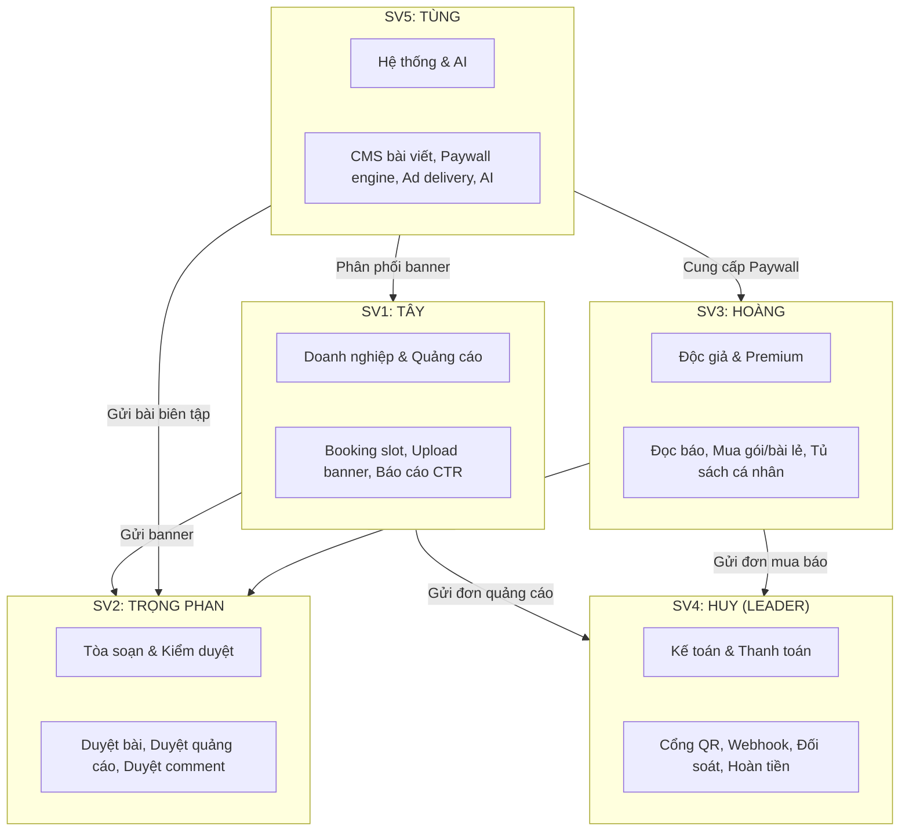
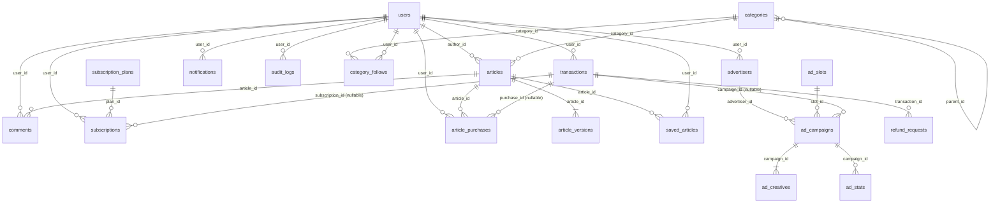
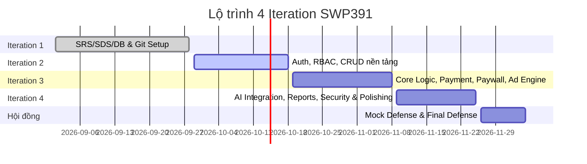

# TÀI LIỆU QUẢN TRỊ DỰ ÁN & NGỮ CẢNH TOÀN DIỆN (MASTER ROADMAP & SYSTEM CONTEXT)
> **Dự án:** LocalPress — Revenue & Trust Platform (Báo điện tử địa phương kết hợp Doanh thu & Kiểm duyệt)  
> **Môn học:** SWP391 — Khóa FALL 2026 — Đại học FPT  
> **Phiên bản:** 1.0 (Master Context for Developers & AI Agents)  
> **Leader phụ trách:** Sinh viên 4 — Huy  

---

## 1. TỔNG QUAN DỰ ÁN (PROJECT OVERVIEW)

### 1.1. Bối cảnh & Ý tưởng
* **LocalPress** là nền tảng báo điện tử phục vụ quy mô cấp tỉnh/địa phương (bối cảnh mẫu: TP. Hải Phòng), giải quyết bài toán tự chủ tài chính cho tòa soạn báo địa phương bằng mô hình doanh thu kép:
  1. **B2B (Quảng cáo doanh nghiệp):** Doanh nghiệp địa phương tự đặt chỗ (booking), tải banner, ký hợp đồng và xem báo cáo minh bạch (Impression, Click, CTR).
  2. **B2C (Nội dung chuyên sâu trả phí - Paywall):** Độc giả có thể đọc bài Free, hoặc trả tiền mua gói tháng/năm hoặc mua lẻ từng bài phóng sự điều tra chuyên sâu.
  3. **Hỗ trợ tòa soạn bằng AI:** AI hỗ trợ tóm tắt tin tức, gợi ý tiêu đề, tự động sinh thẻ tag và hỗ trợ kiểm duyệt nội dung, định giá quảng cáo.

### 1.2. Mục tiêu tối thượng
* Hoàn thành xuất sắc các kỳ Review (Iteration 1 $\rightarrow$ Iteration 4) và **Bảo vệ thành công trước Hội đồng giám khảo SWP391 ĐH FPT**.
* **Nguyên tắc "AI-Assisted, Human-Mastered":** Được phép dùng AI để tăng tốc code, nhưng **100% thành viên phải hiểu sâu bản chất kiến trúc, từng dòng code và thiết kế CSDL**. Không chấp nhận thành viên trả lời "code này do AI viết" khi lên hội đồng.

---

## 2. ĐỘI NGŨ & PHÂN CHIA TRÁCH NHIỆM (TEAM & RACI MATRIX)

Nhóm gồm **5 thành viên**, mỗi thành viên sở hữu trọn vẹn 1 luồng nghiệp vụ end-to-end (Front-end + Back-end + Database liên quan):



### Chi tiết phân công 5 sinh viên:
1. **Sinh viên 4 — Huy (Leader): Luồng Kế toán, Thanh toán & Đối soát**
   * *Nghiệp vụ:* Cổng thanh toán (VNPay / MoMo / VietQR), Webhook/IPN xử lý idempotent, sinh hóa đơn, quản lý công nợ, đối soát ngân hàng, giải quyết khiếu nại và hoàn tiền (Refund API).
   * *Trách nhiệm Leader:* Quản lý Git repository, điều phối tích hợp API giữa các bên, chuẩn hóa tài liệu SRS/SDS, tổ chức Mock Defense nội bộ.
2. **Sinh viên 1 — Tây: Luồng Doanh nghiệp (Advertiser Portal)**
   * *Nghiệp vụ:* Cổng thông tin cho nhà quảng cáo, tra cứu vị trí trống (`ad_slots`), gửi yêu cầu booking, tải creative banner, xem báo cáo hiệu suất (Impressions, Clicks, CTR), quản lý hóa đơn B2B.
3. **Sinh viên 2 — Trọng Phan: Luồng Tòa soạn, Vận hành & Kiểm duyệt**
   * *Nghiệp vụ:* Back-office điều hành tòa soạn; duyệt báo giá quảng cáo; duyệt banner quảng cáo; duyệt bình luận độc giả; quy trình phê duyệt xuất bản bài viết (Reviewer $\rightarrow$ Managing Editor).
4. **Sinh viên 3 — Hoàng: Luồng Khách & Độc giả (Reader Experience)**
   * *Nghiệp vụ:* Giao diện đọc báo công khai, tìm kiếm tin tức, lọc theo chuyên mục; tính năng cá nhân hóa (đánh dấu bài viết, lịch sử đọc, theo dõi chuyên mục); giao diện Paywall chọn mua bài lẻ / mua gói; quản lý phiên đăng nhập giới hạn 2 thiết bị.
5. **Sinh viên 5 — Tùng: Luồng Nền tảng CMS, Paywall Engine, Ad Serving & AI**
   * *Nghiệp vụ:* CMS cho phóng viên soạn bài (quản lý version `article_versions`), Paywall engine kiểm tra quyền truy cập bài viết ở tầng máy chủ, Ad Delivery engine phân phối banner theo slot và chống gian lận click (click fraud), tích hợp AI tóm tắt bài và gợi ý tiêu đề/tag.

---

## 3. THIẾT KẾ CƠ SỞ DỮ LIỆU CHUẨN MỰC (DATABASE SPECIFICATION)

Cơ sở dữ liệu gồm **19 bảng** (18 bảng gốc + 1 bảng `refund_requests` bổ sung để hoàn thiện luồng SV4):



### Các quy tắc dữ liệu sống còn (Data Integrity Rules):
1. **Ràng buộc loại giao dịch (`transactions` CHECK CONSTRAINT):**
   * Một giao dịch chỉ được liên kết đến duy nhất **1** trong 3 đối tượng: `subscription_id` HOẶC `purchase_id` HOẶC `campaign_id`.
   * Cú pháp SQL bắt buộc:
     ```sql
     ALTER TABLE transactions ADD CONSTRAINT chk_single_transaction_target 
     CHECK (
       (subscription_id IS NOT NULL AND purchase_id IS NULL AND campaign_id IS NULL) OR
       (subscription_id IS NULL AND purchase_id IS NOT NULL AND campaign_id IS NULL) OR
       (subscription_id IS NULL AND purchase_id IS NULL AND campaign_id IS NOT NULL)
     );
     ```
2. **Quản lý phiên bản bài viết (`article_versions`):**
   * Khóa duy nhất phức hợp: `UNIQUE (article_id, version_number)`.
   * Nội dung bài viết được lưu ở `article_versions.content` (LONGTEXT), không lưu trực tiếp ở `articles`.
3. **Bảng bổ sung `refund_requests` (Luồng Kế toán SV4):**
   * Các cột: `refund_id (PK)`, `transaction_id (FK)`, `user_id (FK)`, `reason (TEXT)`, `evidence_url (VARCHAR)`, `refund_amount (DECIMAL)`, `status (PENDING, APPROVED, REJECTED, COMPLETED)`, `reviewed_by (FK users)`, `created_at`, `resolved_at`.

---

## 4. HỢP ĐỒNG GIAO TIẾP GIỮA CÁC LUỒNG (INTER-MODULE CONTRACTS)

Để tránh tình trạng "code ai người nấy viết rồi không ghép được vào nhau", quy định các điểm tiếp xúc:

| Bên gọi (Caller) | Bên phục vụ (Provider) | Mục đích / Hợp đồng giao tiếp |
| :--- | :--- | :--- |
| **SV1 & SV3** | **SV4 (Payment)** | **Gọi chung một Service tạo đơn thanh toán:** `createPaymentOrder(userId, type, targetId, amount)`. SV4 sinh mã QR/URL chuyển khoản, lắng nghe Webhook IPN, sau khi thành công sẽ kích hoạt event cập nhật trạng thái đơn cho SV1/SV3. |
| **SV3 (Reader)** | **SV5 (Paywall)** | **Kiểm tra quyền truy cập bài:** Khi Reader mở bài viết, tầng Controller của SV3 gọi `PaywallEngine.checkAccess(userId, articleId)`. Nếu là Free $\rightarrow$ trả toàn văn; nếu Premium và chưa mua $\rightarrow$ chỉ trả bản tóm tắt/30% nội dung (cắt từ máy chủ, không cắt bằng CSS Front-end). |
| **SV1 (Advertiser)** | **SV2 (Staff)** | **Hàng đợi duyệt quảng cáo:** Khi SV1 nộp banner `ad_creatives`, hệ thống chuyển trạng thái sang `PENDING_REVIEW` và đưa vào hàng đợi của SV2. SV2 bấm Duyệt/Từ chối kèm lý do. |
| **SV5 (Editor)** | **SV2 (Managing Editor)** | **Hàng đợi xuất bản bài:** Editor hoàn thiện bài draft, bấm Nộp duyệt. SV2 nhận thông báo, đọc bài, phản hồi chỉnh sửa hoặc duyệt Xuất bản (`PUBLISHED`). |
| **SV3 (Reader)** | **SV2 (Moderator)** | **Kiểm duyệt bình luận:** Bình luận độc giả mặc định ở trạng thái `PENDING`. SV2 kiểm duyệt, chỉ khi chuyển sang `APPROVED` thì SV3 mới hiển thị ra ngoài giao diện. |

---

## 5. LỘ TRÌNH THỰC HIỆN 4 ITERATION (MILESTONE ROADMAP)



### Iteration 1: Đóng khung Tài liệu & Cấu trúc (Deadline sắp tới)
* **Việc làm ngay của Leader Huy:**
  1. Dọn sạch rác "Recruitment / Candidate" trong tài liệu SRS.
  2. Bổ sung Swimlane SV2 (Trọng Phan) vào mục 2.3.4.
  3. Cập nhật sửa đánh số thứ tự (2.3.1 $\rightarrow$ 2.3.5).
  4. Xuất lại file ảnh chuẩn cho Swimlane SV3 của Hoàng.
  5. Sửa lỗi Package Diagram trong SDS (nối Integration vào Service).
  6. Setup Git repository, tạo nhánh `dev` và quy chuẩn commit.

### Iteration 2: Khung sườn, Phân quyền & CRUD cơ bản
* Triển khai cấu trúc thư mục chuẩn theo Package Diagram.
* Đăng ký, Đăng nhập, Quản lý tài khoản (Users), Phân quyền RBAC theo Role (Guest, Reader, Advertiser, Staff, Admin).
* CRUD Danh mục báo (`categories`), Gói cước (`subscription_plans`), Vị trí quảng cáo (`ad_slots`).
* Dựng Layout chuẩn: Header, Footer, Sidebar, Navigation dùng chung cho toàn đội.

### Iteration 3: Các luồng nghiệp vụ lõi (The Core Business Logic)
* **SV4:** Tích hợp Cổng thanh toán (môi trường Sandbox MoMo / VNPay / VietQR), xử lý Webhook IPN, lưu lịch sử `transactions`.
* **SV5:** Xây dựng Paywall Engine (chặn truy cập bài viết ở Back-end) và Ad Delivery Engine (hiển thị banner đúng vị trí và thời gian).
* **SV1:** Luồng đặt quảng cáo (Booking flow) hoàn chỉnh.
* **SV2:** Luồng phê duyệt đa cấp (Duyệt bài, duyệt banner, duyệt comment).
* **SV3:** Luồng đọc báo, cá nhân hóa (Bookmark, Follow category), mua bài lẻ và mua gói.

### Iteration 4: Nghiệp vụ nâng cao, AI, Báo cáo & Hoàn thiện
* **SV5:** Tích hợp OpenAI/Gemini API hỗ trợ tóm tắt bài viết, tự động gán nhãn tag, gợi ý tiêu đề chuẩn SEO.
* **SV4:** Chức năng đối soát, quản lý công nợ, khiếu nại và hoàn tiền (Refund).
* **SV1 & SV2:** Báo cáo phân tích chiến dịch quảng cáo (Impression, Click, CTR chart).
* **Kiểm tra bảo mật toàn diện:** Chống SQL Injection, XSS, CSRF, Password Hashing (BCrypt), phân quyền URL ở tầng Interceptor/Filter.

---

## 6. SỔ TAY "TỬ HUYỆT" PHẢN BIỆN TRƯỚC HỘI ĐỒNG (DEFENSE SURVIVAL GUIDE)

Dưới đây là các câu hỏi "bẫy" mà giảng viên Hội đồng FPT thường xuyên hỏi:

| Vị trí | Câu hỏi xoáy của Giảng viên | Hướng trả lời chuẩn xác |
| :--- | :--- | :--- |
| **SV4 (Huy)** | *"Nếu người dùng quét mã thanh toán xong tắt trình duyệt luôn, không bấm nút 'Quay lại', hệ thống có cập nhật trạng thái đã thanh toán không?"* | **"Có ạ.** Hệ thống của em không phụ thuộc vào `return_url` của trình duyệt mà xử lý hoàn toàn tự động qua **Webhook/IPN (Instant Payment Notification)** từ máy chủ cổng thanh toán bắn trực tiếp về backend của em. Luồng này có xử lý kiểm tra chữ ký số (Checksum HMAC SHA512) và đảm bảo tính Idempotent để chống cộng tiền 2 lần." |
| **SV5 (Tùng)** | *"Bài viết Premium được làm mờ thế nào? Nếu người dùng bấm F12 xem Elements hoặc Inspect mã nguồn HTML thì có đọc trộm được không?"* | **"Dạ không thể xem trộm được.** Hệ thống của em kiểm tra quyền ở tầng **Server-side (Paywall Engine)**. Nếu người dùng chưa mua bài, server chỉ trả về 30% văn bản tóm tắt. Giao diện làm mờ chỉ là hiệu ứng CSS, chứ trong DOM HTML hoàn toàn không có 70% nội dung còn lại." |
| **SV3 (Hoàng)** | *"Hệ thống khống chế độc giả chỉ được đăng nhập tối đa 2 thiết bị bằng cách nào?"* | Trình bày cơ chế lưu `session_id` hoặc JWT refresh token kèm thông tin thiết bị (User-Agent, IP). Khi thiết bị thứ 3 đăng nhập, hệ thống sẽ đẩy thông báo yêu cầu đăng xuất một trong 2 phiên cũ. |
| **SV1 (Tây)** | *"Làm sao hệ thống của bạn biết một vị trí quảng cáo đã kín lịch hay chưa để không cho người khác đặt trùng?"* | Giải thích hàm kiểm tra xung đột thời gian (Date overlap query): `(start_date <= :newEnd AND end_date >= :newStart)` trên bảng `ad_campaigns` có trạng thái đã duyệt/đang chạy. |
| **SV2 (Trọng)** | *"Quy trình duyệt bài có mấy cấp? Phóng viên có tự ý sửa bài sau khi đã được duyệt xuất bản không?"* | Bài viết quản lý theo `article_versions`. Sau khi phiên bản N được duyệt `PUBLISHED`, nếu sửa thì hệ thống tự động sinh phiên bản N+1 ở trạng thái `DRAFT` và phải trải qua quy trình duyệt lại từ đầu, bài cũ vẫn hiển thị trên trang cho đến khi bài mới được duyệt. |

---

## 7. QUY CHUẨN CODE & DÙNG AI CHO CẢ NHÓM (AI USAGE RULES)

1. **Quy tắc "Hiểu code trước khi Commit":** Mọi đoạn code được sinh bởi AI (ChatGPT, Claude, Gemini, GitHub Copilot) phải được người viết tự đọc lại từng dòng.
2. **Comment giải thích logic nghiệp vụ:** Các đoạn code phức tạp (hàm tính tiền, hàm check paywall, hàm IPN, hàm query JOIN) phải có comment giải thích:
   * Input nhận gì?
   * Xử lý điều kiện biên gì?
   * Output trả về gì?
3. **Quy chuẩn Git:**
   * Không commit trực tiếp lên `main` và `dev`.
   * Tạo nhánh tính năng theo định dạng: `feature/<ma-sv>-<ten-chuc-nang>` (Ví dụ: `feature/sv4-vnpay-ipn`).
   * Leader Huy là người review code cuối cùng trước khi merge vào `dev`.
