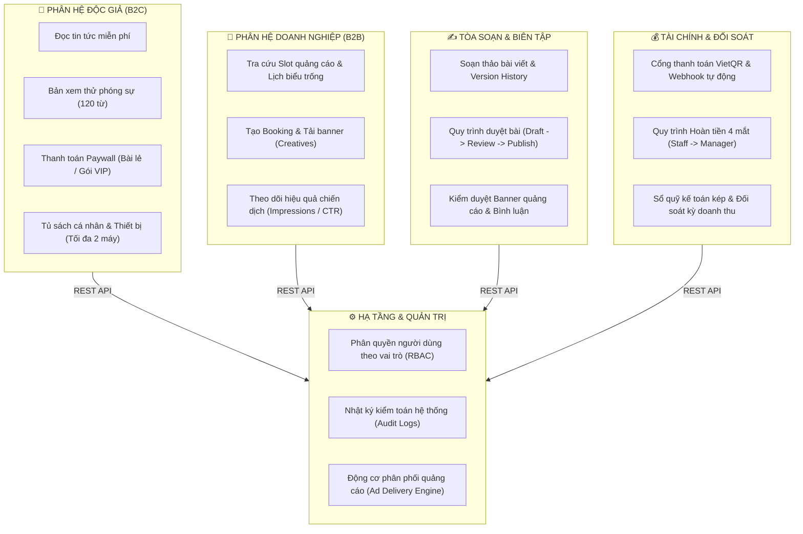

<div align="center">

# 📰 LocalPress — Revenue & Trust Platform
**Nền tảng Báo điện tử Địa phương kết hợp Doanh thu Tự chủ & Kiểm duyệt Tin tức**  
*Đồ án tốt nghiệp / Dự án Capstone SWP391 — Học kỳ FALL 2026 — Đại học FPT*  
*Bối cảnh triển khai mẫu: Báo chí Dữ liệu & Thương mại TP. Hải Phòng*

<br/>

[](https://spring.io/projects/spring-boot)
[](https://www.oracle.com/java/)
[](https://react.dev/)
[](https://www.typescriptlang.org/)
[](https://vitejs.dev/)
[](https://tailwindcss.com/)
[](https://www.mysql.com/)
[](https://vitest.dev/)

<br/>

[Tổng quan](#-1-tổng-quan-dự-án) • [Kiến trúc hệ thống](#-2-kiến-trúc-nghiệp-vụ) • [Phân chia thành viên](#-3-đội-ngũ--phân-chia-trách-nhiệm-raci) • [Tài khoản Demo](#-4-tài-khoản-thử-nghiệm-demo-personas) • [Hướng dẫn cài đặt](#-5-hướng-dẫn-cài-đặt--khởi-chạy)

</div>

---

## 📌 1. TỔNG QUAN DỰ ÁN

**LocalPress** giải quyết trực diện bài toán tự chủ tài chính cho các cơ quan báo chí địa phương trong kỷ nguyên số. Thay vì phụ thuộc vào quảng cáo rác mạng lưới (Google AdSense giá rẻ) hoặc bầu sữa ngân sách, nền tảng xây dựng mô hình **doanh thu kép bền vững**:

1. **B2C — Paywall nội dung chuyên sâu:** Độc giả được đọc tin tức sự kiện miễn phí, nhưng các tuyến bài phóng sự điều tra độc quyền, dữ liệu kinh tế cảng biển sâu đòi hỏi mua lẻ theo bài (15.000 ₫/lượt) hoặc mua gói hội viên định kỳ (Tháng / Quý / Năm). Hệ thống hỗ trợ đọc thử 120 từ mở đầu (preview lead-in) và giới hạn phiên đăng nhập tối đa 2 thiết bị.
2. **B2B — Quảng cáo tự phục vụ (Self-service Ad Booking):** Doanh nghiệp địa phương (Logistics, Bất động sản, Dịch vụ cảng) tự tra cứu vị trí trống (Ad Slots) theo lịch biểu thời gian thực, đặt chỗ, tải banner và ký hợp đồng trực tuyến. Báo cáo minh bạch lượt hiển thị (Impressions), lượt nhấp (Clicks) và tỷ lệ CTR.
3. **Tòa soạn số & Kiểm duyệt nhiều lớp:** Phóng viên soạn bài với trình soạn thảo Markdown/RichText, lưu lịch sử phiên bản (Version History). Thư ký tòa soạn kiểm duyệt bài viết, kiểm duyệt banner quảng cáo và kiểm duyệt bình luận của độc giả.
4. **Tài chính minh bạch & Kiểm soát rủi ro:** Quản lý luồng giao dịch ngân hàng VietQR/Webhook, quy trình hoàn tiền tuân thủ nghiêm ngặt **nguyên tắc 4 mắt (Four-Eyes Principle)** (Kế toán viên đề xuất $\rightarrow$ Kế toán trưởng phê duyệt), tự động hạch toán sổ quỹ kép (General Ledger).

---

## 🏛️ 2. KIẾN TRÚC NGHIỆP VỤ



---

## 👥 3. ĐỘI NGŨ & PHÂN CHIA TRÁCH NHIỆM (RACI)

Dự án được phân rã thành 5 phân hệ độc lập, mỗi thành viên chịu trách nhiệm trọn vẹn từ Giao diện (Frontend) đến Nghiệp vụ xử lý (Backend) và Thiết kế CSDL (Database):

| Thành viên | Vai trò | Phân hệ phụ trách | Use Cases & Trọng tâm kỹ thuật |
|:---|:---:|:---|:---|
| **SV4: Huy** | **Leader** | **Tài chính & Thanh toán** | • Cổng thanh toán VietQR, Webhook IPN xử lý bất đồng bộ, Idempotent chống trùng tiền.<br/>• Quy trình hoàn tiền 4 mắt (Four-Eyes Principle) & Ghi sổ quỹ kế toán kép.<br/>• Đối soát doanh thu theo kỳ và quản lý hóa đơn. |
| **SV1: Tây** | Thành viên | **Doanh nghiệp & Quảng cáo B2B** | • Tra cứu ma trận Ad Slots trống theo thời gian thực (tránh trùng lịch đặt).<br/>• Luồng tạo đơn booking quảng cáo, tải banner hợp quy chuẩn kích thước.<br/>• Báo cáo phân tích chiến dịch: Impressions, Clicks, CTR, chi phí theo ngày. |
| **SV2: Trọng Phan** | Thành viên | **Tòa soạn & Kiểm duyệt CMS** | • Soạn thảo bài báo đa phương tiện, quản lý lịch sử chỉnh sửa (Version History).<br/>• Luồng duyệt bài phóng viên $\rightarrow$ biên tập $\rightarrow$ xuất bản.<br/>• Kiểm duyệt banner quảng cáo B2B và kiểm duyệt bình luận độc giả. |
| **SV3** | Thành viên | **Độc giả & Nội dung B2C** | • Trải nghiệm đọc báo, chuyên mục, tìm kiếm bài viết, gợi ý tin liên quan.<br/>• Cổng Paywall trích đoạn 120 từ, quy trình mua bài và đăng ký gói hội viên.<br/>• Quản lý tủ sách đã mua, lịch sử đọc và quản lý phiên đăng nhập 2 thiết bị. |
| **SV5** | Thành viên | **Quản trị hệ thống & Giám sát** | • Quản lý người dùng, ma trận phân quyền tài khoản (RBAC).<br/>• Nhật ký kiểm toán toàn hệ thống (Audit Logs) phục vụ truy vết bảo mật.<br/>• Giám sát trạng thái phân phối banner (Ad Delivery Live Status). |

---

## 🔑 4. TÀI KHOẢN THỬ NGHIỆM (DEMO PERSONAS)

Giao diện tích hợp sẵn **Role Switcher Bar** nằm cố định ở góc dưới màn hình. Bạn có thể chuyển đổi tức thì giữa các phân hệ với 1 cú click chuột mà không cần gõ mật khẩu:

| Phân hệ | Tài khoản | Tên hiển thị | Quyền hạn & Trải nghiệm chính |
|:---|:---|:---|:---|
| **Khách** | `user-guest` | Khách vãng lai | Đọc tin thường, đọc thử đoạn trích 120 từ bài Paywall, xem thông báo khóa bài. |
| **Độc giả Free** | `user-reader-free` | Nguyễn Văn An | Tài khoản có lịch sử đọc, đánh dấu bài viết, giỏ hàng thanh toán. |
| **Độc giả VIP** | `user-reader-premium` | Trần Thị Mai | Sở hữu Gói Năm VIP, đọc toàn quyền mọi phóng sự điều tra không giới hạn. |
| **Doanh nghiệp 1** | `user-adv-1` | Đặng Quang Huy | Đại diện *Logistics Cảng Hải Phòng*: Booking banner, xem báo cáo CTR cảng. |
| **Doanh nghiệp 2** | `user-adv-2` | Lê Hồng Phong | Đại diện *BĐS Đất Cảng Hải Phòng*: Xem danh sách hợp đồng, chi phí quảng cáo. |
| **Phóng viên** | `user-editor` | Nguyễn Văn Biên Tập | Soạn thảo tin bài, lưu bản nháp, nộp duyệt bài lên tòa soạn. |
| **Thư ký tòa soạn** | `user-reviewer` | Trần Thị Thư Ký | Duyệt xuất bản bài viết, duyệt bản thiết kế banner quảng cáo B2B. |
| **Kế toán viên** | `user-fin-staff` | Lê Thị Thu Ngân | Tra cứu đơn hàng VietQR, lập phiếu đề xuất hoàn tiền cho khách. |
| **Kế toán trưởng** | `user-fin-mgr` | Phạm Trưởng Phòng | Phê duyệt hoàn tiền (nguyên tắc 4 mắt), chốt sổ đối soát kỳ kế toán. |
| **Quản trị viên** | `user-admin` | Vũ Quản Trị | Phân quyền RBAC, theo dõi Audit Log, giám sát động cơ chạy banner. |

> 💡 **Khôi phục dữ liệu gốc:** Nút **"Reset"** trên thanh Role Switcher cho phép xóa dữ liệu đã thao tác trong LocalStorage và khôi phục về trạng thái Seed Data chuẩn Hải Phòng ban đầu.

---

## 📁 5. CẤU TRÚC THƯ MỤC CHUẨN MONOREPO

```text
LocalPress/
├── backend/                                   # Mã nguồn Backend (Spring Boot 3 + MySQL)
│   ├── pom.xml                                # Quản lý dependencies (JPA, Security, Flyway, JWT, Lombok)
│   └── src/
│       ├── main/
│       │   ├── java/com/localpress/
│       │   │   ├── LocalPressApplication.java # Entry point khởi chạy Spring Boot
│       │   │   ├── identity/                  # Quản lý người dùng, tài khoản & xác thực
│       │   │   ├── reader/                    # Nghiệp vụ tài khoản độc giả B2C
│       │   │   ├── content/                   # Quản lý chuyên mục & bài viết
│       │   │   ├── editorial/                 # Quy trình biên tập & kiểm duyệt tòa soạn
│       │   │   ├── advertising/               # Quản lý chiến dịch quảng cáo B2B
│       │   │   ├── finance/                   # Xử lý đơn hàng, VietQR, hoàn tiền, đối soát
│       │   │   ├── delivery/                  # Động cơ tracking phân phối banner
│       │   │   ├── administration/            # Cấu hình hệ thống, phân quyền RBAC & Audit Log
│       │   │   └── shared/                    # Dùng chung (CORS, ApiResponse, AppException, Consts)
│       │   └── resources/
│       │       ├── application.yml            # Cấu hình chung của ứng dụng
│       │       ├── application-dev.yml        # Cấu hình MySQL datasource dev
│       │       └── db/migration/              # Flyway migrations (V1 DDL + V2 Seed Data Hải Phòng)
│       └── test/java/com/localpress/
│
└── frontend/                                  # Mã nguồn Frontend (React 19 + TypeScript + Vite)
    ├── package.json
    ├── vite.config.ts
    └── src/
        ├── app/                               # Cấu hình Router, TanStack Query Providers, App Config
        ├── layouts/                           # 4 Khu vực Layout: Public, Reader, Advertiser, Backoffice
        ├── components/                        # UI Atoms (Button, Card, Dialog...) & Shared components
        ├── features/                          # Tổ chức mã nguồn theo Domain nghiệp vụ
        │   ├── identity/                      # Đăng nhập, đăng ký, quên mật khẩu
        │   ├── reader/                        # Trang chủ báo, chi tiết bài, Paywall modal, giỏ hàng
        │   ├── advertising/                   # Dashboard B2B, tra cứu Slot, tạo Booking, báo cáo CTR
        │   ├── editorial/                     # CMS soạn bài, danh sách bài, duyệt bài, duyệt banner
        │   ├── finance/                       # Dashboard kế toán, danh sách đơn, hoàn tiền, sổ quỹ
        │   └── administration/                # Quản lý User, phân quyền RBAC, giám sát Ad Delivery
        ├── lib/                               # HTTP Client (Axios wrapper), định dạng tiền tệ VND
        ├── mocks/                             # Stateful Reactive Store & REST Handlers (chạy độc lập)
        └── tests/                             # Bộ kiểm thử nghiệp vụ tự động (Vitest)
```

---

## 🚀 6. HƯỚNG DẪN CÀI ĐẶT & KHỞI CHẠY

### 6.1. Khởi chạy Frontend (React 19 + Vite)
Frontend được thiết kế với cơ chế **Dual-Mode**: Mặc định chạy ở chế độ **Mock API Stateful** (đầy đủ tính năng, lưu trữ localStorage, không bắt buộc phải bật backend khi review giao diện).

```bash
# 1. Di chuyển vào thư mục frontend
cd frontend

# 2. Cài đặt các gói phụ thuộc
npm install

# 3. Chạy môi trường phát triển (Dev server)
npm run dev

# 4. Thực thi bộ kiểm thử nghiệp vụ (Vitest)
npm run test
```

- Địa chỉ truy cập: **`http://localhost:5173`**
- *Để chuyển sang kết nối Backend thật:* Đặt `VITE_USE_MOCK_API=false` trong file `.env` hoặc chỉnh tại [src/app/config.ts](file:///e:/FPTU/FALL26/SWP391/frontend/src/app/config.ts).

### 6.2. Khởi chạy Backend (Spring Boot 3 + MySQL)
Yêu cầu: Máy đã cài đặt **Java 17** hoặc **Java 21**, và máy chủ **MySQL 8.0**.

```bash
# 1. Di chuyển vào thư mục backend
cd backend

# 2. Tạo database MySQL (nếu chưa có)
# mysql -u root -p -e "CREATE DATABASE IF NOT EXISTS localpress_db CHARACTER SET utf8mb4;"

# 3. Khởi chạy ứng dụng với Maven
mvn spring-boot:run
```

- API Base URL: **`http://localhost:8080/api/v1`**
- CORS đã được cấu hình sẵn cho các cổng `http://localhost:5173`, `http://localhost:3000`.
- Flyway sẽ tự động kích hoạt tạo bảng (V1) và chèn dữ liệu mẫu Hải Phòng (V2).

---

## 📋 7. TÀI LIỆU QUẢN TRỊ DỰ ÁN & BẢO VỆ HỘI ĐỒNG
- Chi tiết về ma trận đặc tả ca sử dụng (Use Cases), hợp đồng API RESTful, thiết kế lược đồ CSDL quan hệ và các câu hỏi vấn đáp trọng tâm trước hội đồng SWP391 được lưu trữ tại:  
  👉 **[LOCALPRESS_MASTER_ROADMAP.md](LOCALPRESS_MASTER_ROADMAP.md)**
