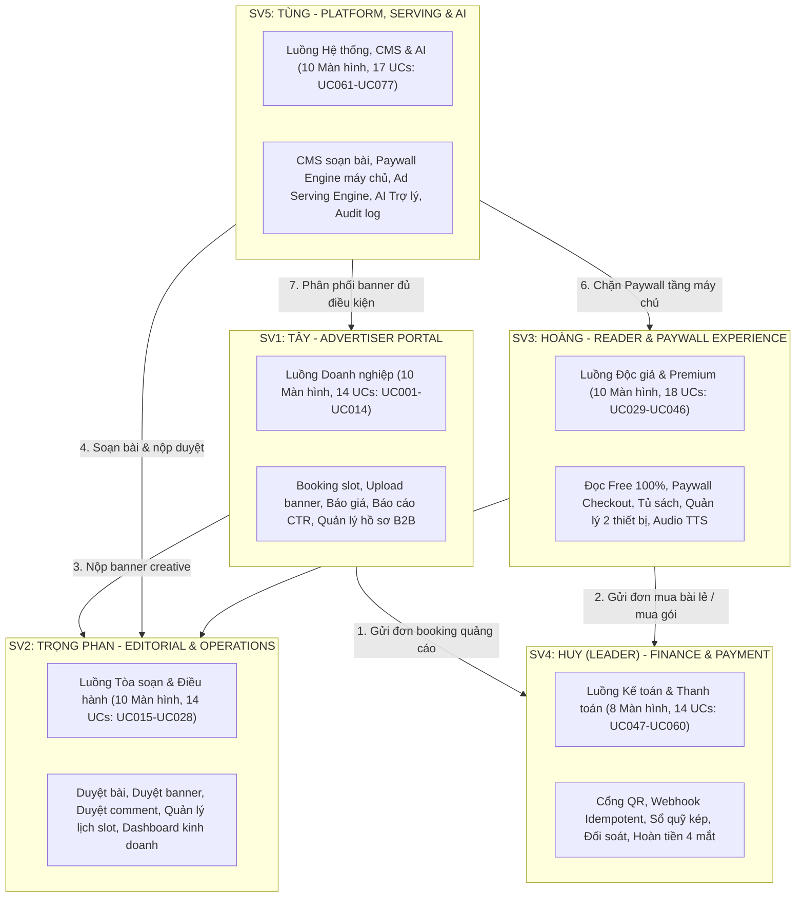

# LocalPress — Revenue & Trust Platform

> **Nền tảng báo điện tử địa phương kết hợp Doanh thu tự chủ & Kiểm duyệt tin tức đa tầng**  
> **Dự án:** SWP391 — Học kỳ FALL 2026 — Đại học FPT  
> **Nhóm thực hiện:** Nhóm 2 (Leader: SV4 — Huy)  
> **Phiên bản:** 2.1 (Đồng bộ chuẩn hóa theo 77 Use Cases, 48 Màn hình & Ma trận CRUD 19 bảng từ `project_tracking_group2.xlsx` và Đặc tả 125 tiêu chí từ `LocalPress_Danh_muc_chuc_nang.docx`)

---

## 1. TỔNG QUAN HỆ THỐNG (SYSTEM OVERVIEW)

LocalPress là giải pháp chuyển đổi số toàn diện cho cơ quan báo chí cấp tỉnh (bối cảnh mẫu: **TP. Hải Phòng** - trung tâm kinh tế biển, công nghiệp và logistics lớn nhất miền Bắc). Hệ thống giải quyết trọn vẹn bài toán tự chủ tài chính cho báo chí địa phương thông qua mô hình **Doanh thu kép (Hybrid Revenue Model)** kết hợp bảo vệ uy tín thông tin:

1. **B2B — Cổng quảng cáo doanh nghiệp tự phục vụ (Self-serve Advertising):**
   * Doanh nghiệp địa phương chủ động tra cứu vị trí trống (`ad_slots`), chọn lịch, đặt chỗ (booking), tải lên banner quảng cáo (`ad_creatives`).
   * Thanh toán trực tuyến tự động qua VietQR / Cổng thanh toán, theo dõi tiến trình phê duyệt và nhận báo cáo hiệu suất minh bạch (Impressions, Clicks, CTR, Clicks bị lọc do nghi vấn gian lận).
2. **B2C — Nội dung chuyên sâu & Tường thu phí (Content Paywall):**
   * Độc giả vãng lai (Guest) đọc toàn bộ tin tức thời sự dân sinh miễn phí 100% không bắt buộc đăng nhập.
   * Các bài điều tra, phóng sự độc quyền được bảo vệ bằng **Server-side Paywall** (chỉ trả về 30% preview trích xuất từ backend). Độc giả có thể mua lẻ từng bài (15.000 ₫/bài) hoặc mua các gói hội viên định kỳ (tháng/quý/năm) với các đặc quyền: đọc không quảng cáo, nghe audio giọng đọc AI và đọc đa thiết bị (tối đa 2 thiết bị đồng thời).
3. **Tòa soạn số & Kiểm duyệt đa tầng (Newsroom & Multi-stage Moderation):**
   * Quản lý vòng đời bài viết chặt chẽ qua nhiều phiên bản (`article_versions`), kiểm duyệt banner quảng cáo trước khi lên trang để bảo đảm an toàn thương hiệu, kiểm duyệt bình luận độc giả (sửa bình luận phải duyệt lại).
4. **Tài chính, Sổ quỹ kép & Hoàn tiền an toàn (Finance & Ledgers):**
   * Quản lý đơn hàng tập trung (`transactions`), xử lý Webhook IPN Idempotent từ ngân hàng/cổng thanh toán, sổ quỹ kép (General Ledger), đối soát dòng tiền và quy trình hoàn tiền theo nguyên tắc 4 mắt (Four-Eyes Principle).
5. **Trợ lý AI hỗ trợ tòa soạn (AI-Assisted, Human-Mastered):**
   * Tăng tốc quy trình tác nghiệp của phóng viên và biên tập viên: Tự động gợi ý 3 phong cách tiêu đề, tóm tắt sapo, gợi ý chuyên mục quảng cáo cho doanh nghiệp, cảnh báo từ ngữ độc hại trong bình luận và phát hiện giao dịch bất thường; con người luôn là bên duyệt cuối cùng.

---

## 2. PHÂN CÔNG THÀNH VIÊN & MA TRẬN TRÁCH NHIỆM (TEAM RACI)

Hệ thống được phân rã thành **5 luồng nghiệp vụ end-to-end**, mỗi sinh viên làm chủ từ Giao diện $\rightarrow$ API Backend $\rightarrow$ Thiết kế CSDL $\rightarrow$ Kiểm thử tự động. Kiến trúc và tiến độ dự án được quản lý trực tiếp qua **77 Use Cases (`UC001` - `UC077`)** và **48 Màn hình / Phân hệ chức năng** trong bảng theo dõi chính thức [`project_tracking_group2.xlsx`](project_tracking_group2.xlsx), được cụ thể hóa từ **125 tiêu chí nghiệp vụ** trong tài liệu yêu cầu gốc [`LocalPress_Danh_muc_chuc_nang.docx`](LocalPress_Danh_muc_chuc_nang.docx):



### Chi tiết phân công 5 sinh viên:

| Phân hệ | Sinh viên phụ trách | Vai trò chính | Use Cases & Màn hình (`project_tracking_group2.xlsx`) | Phạm vi tiêu chí nghiệp vụ (`LocalPress_Danh_muc_chuc_nang.docx`) |
| :--- | :--- | :--- | :--- | :--- |
| **SV4** | **Huy (Leader)** | Kế toán, Thanh toán & Đối soát | **14 Use Cases (`UC047` - `UC060`)**, **8 Màn hình** (SRS/SDS II.4.1 - II.4.8). Lộ trình: Iter 1 (2), Iter 2 (2), Iter 3 (4). | 25 tiêu chí (12 P0, 12 P1, 1 P2): Bộ xử lý thanh toán dùng chung, Webhook IPN chống trùng, sinh mã VietQR, hóa đơn VAT, sổ quỹ kép, đối soát sao kê ngân hàng, quy trình hoàn tiền 4 mắt. |
| **SV1** | **Tây** | Doanh nghiệp & Quảng cáo B2B | **14 Use Cases (`UC001` - `UC014`)**, **10 Màn hình** (SRS/SDS II.1.1 - II.1.10). Lộ trình: Iter 1 (2), Iter 2 (4), Iter 3 (4). | 25 tiêu chí (16 P0, 9 P1, 0 P2): Cổng portal cho nhà quảng cáo, tra cứu vị trí trống, nộp booking, upload banner có preview thực tế, báo cáo chỉ số CTR minh bạch, hồ sơ doanh nghiệp. |
| **SV2** | **Trọng Phan** | Tòa soạn, Kinh doanh & Kiểm duyệt | **14 Use Cases (`UC015` - `UC028`)**, **10 Màn hình** (SRS/SDS II.2.1 - II.2.10). Lộ trình: Iter 1 (2), Iter 2 (4), Iter 3 (4). | 25 tiêu chí (14 P0, 8 P1, 3 P2): Back-office điều hành; duyệt báo giá hợp đồng; kiểm duyệt banner quảng cáo; duyệt bài viết xuất bản; duyệt bình luận độc giả; quản lý danh mục gói đọc báo. |
| **SV3** | **Hoàng** | Khách & Độc giả B2C | **18 Use Cases (`UC029` - `UC046`)**, **10 Màn hình** (SRS/SDS II.3.1 - II.3.10). Lộ trình: Iter 1 (3), Iter 2 (4), Iter 3 (3). | 25 tiêu chí (18 P0, 6 P1, 1 P2): Đọc tin tức công khai 100% Free; màn hình preview Paywall; giỏ hàng/checkout bài lẻ & gói; tủ sách cá nhân (lịch sử, bookmark, follow chuyên mục); khống chế phiên 2 thiết bị. |
| **SV5** | **Tùng** | Hệ thống, Paywall Engine & AI | **17 Use Cases (`UC061` - `UC077`)**, **10 Màn hình** (SRS/SDS II.5.1 - II.5.10). Lộ trình: Iter 1 (2), Iter 2 (3), Iter 3 (5). | 25 tiêu chí (17 P0, 7 P1, 1 P2): CMS soạn thảo và quản lý phiên bản bài viết; Paywall Engine ở máy chủ; Ad Serving Engine phân phối banner và lọc click tặc; tích hợp AI tóm tắt/tiêu đề; hạ tầng audit log. |

### Lộ trình 3 Đợt triển khai theo Activity Flow (Đầu $\rightarrow$ Giữa $\rightarrow$ Cuối quy trình):

* **Iteration 1 — Đầu quy trình (11 màn hình):** Ingestion, Setup, Master Data, Đọc Free & Soạn bài cơ bản.
  * SV1: `Company Profile` (UC002), `Ad Slot Catalog` (UC003)
  * SV2: `Article Review and Publishing` (UC025), `Content Policy and Moderation` (UC026-UC028)
  * SV3: `Homepage and Article Search` (UC029-UC030), `Article Reader` (UC031-UC032), `Authentication` (UC033)
  * SV4: `Financial Documents and Ledger` (UC057-UC058), `Manual Bank Transfer Confirmation` (UC051)
  * SV5: `Article Editor` (UC061), `Article Metadata and Media` (UC063-UC064)
* **Iteration 2 — Giữa quy trình (17 màn hình):** Giao dịch lõi, Thanh toán QR/IPN, Paywall Server-side, Booking & Duyệt banner.
  * SV1: `Campaign Booking` (UC004-UC005), `Quotation Confirmation` (UC006), `Advertising Payment` (UC007), `Creative Submission and Preview` (UC008)
  * SV2: `Pending Booking Queue` (UC016), `Advertising Inventory Calendar` (UC017), `Quotation Management` (UC018), `Creative Review` (UC020-UC022)
  * SV3: `Premium Checkout` (UC034-UC035), `Premium Article Reader` (UC036), `Personal Bookshelf` (UC037-UC039), `Comments and Reports` (UC041-UC042)
  * SV4: `Payment Processing` (UC047-UC050), `Advertiser Receivables` (UC053)
  * SV5: `Article Version History` (UC062), `Article Submission and Revision` (UC066-UC067), `Content Access and Paywall` (UC068-UC069)
* **Iteration 3 — Cuối quy trình (20 màn hình):** Đối soát, Hoàn tiền 4 mắt, Báo cáo & Dashboard, AI Cố vấn, Ad Serving & Admin.
  * SV1: `Advertising Dashboard` (UC001, UC010-UC011), `Creative Replacement` (UC009), `Requests and Business Notifications` (UC013-UC014), `Contracts and Documents` (UC012)
  * SV2: `Campaign Eligibility Check` (UC023), `Campaign Control` (UC024), `Advertising Contract Management` (UC019), `Business Operation Dashboard` (UC015)
  * SV3: `Followed Content` (UC040), `Devices and Sessions` (UC043), `Subscription, Transactions and Support` (UC044-UC046)
  * SV4: `Cash Flow Dashboard` (UC052), `Payment Reconciliation` (UC054), `Refund and Rights Management` (UC055-UC056), `Financial Reports and Alerts` (UC059-UC060)
  * SV5: `AI Editorial Assistant` (UC065), `Advertising Slot Configuration` (UC070), `Advertisement Delivery and Tracking` (UC071-UC072), `Advertisement URL Monitoring` (UC073), `System Administration Console` (UC074-UC077)

---

## 3. 16 QUY TẮC NGHIỆP VỤ BẤT BIẾN (INVARIANT BUSINESS RULES)

Để bảo đảm tính toàn vẹn dữ liệu và ngăn chặn tuyệt đối xung đột giữa 5 luồng, hệ thống thiết lập **16 quy tắc cốt lõi**:

1. **Đọc Free 100% không bắt đăng nhập:** Guest đọc toàn bộ bài Free, xem chuyên mục, tìm kiếm và xem bình luận đã duyệt mà không bị ép modal đăng ký.
2. **Quyền Premium theo Scope bài/gói:** Quyền đọc cấp theo `article_id` hoặc `category_id`/toàn trang. Không dùng cờ `is_premium` chung chung.
3. **Paywall thực thi ở tầng Server-side:** Khi bài viết là PREMIUM và người đọc chưa mua, API **chỉ trả về 30% preview trích xuất từ backend**. Tuyệt đối không gửi toàn văn về client rồi dùng CSS làm mờ (chống F12 Inspect).
4. **Xác minh thanh toán độc lập ở Backend:** Quyền đọc và trạng thái hợp đồng chỉ được kích hoạt khi nhận Webhook IPN có chữ ký số (HMAC SHA512) hợp lệ từ Cổng thanh toán; không phụ thuộc vào `return_url` trên trình duyệt.
5. **Webhook Idempotency & Tự phục hồi:** Xử lý Webhook Idempotent theo mã đơn duy nhất để chống việc ngân hàng gửi lại webhook gây cộng tiền hai lần. Nếu tiền đã nhận nhưng cấp quyền bị nghẽn mạng, worker tự động chạy lại để bù quyền.
6. **Xử lý tiền về muộn khi giữ chỗ đã hết hạn:** Nếu khách chuyển tiền sau khi thời hạn giữ chỗ 30 phút đã hết, hệ thống kiểm tra lại lịch: nếu còn chỗ thì kích hoạt, nếu đã có người khác mua thì đưa vào hàng đợi hoàn tiền hoặc chuyển lịch.
7. **Chống trùng lịch (Double Booking) tại Database:** Chống đặt trùng slot quảng cáo độc quyền bằng cơ chế khóa bản ghi tại Database Transaction (Pessimistic/Optimistic lock).
8. **Banner và Bài viết sửa đều sinh Version mới:** Khi doanh nghiệp sửa ảnh banner hoặc URL, hệ thống sinh phiên bản mới `ad_creatives.version_number` ở trạng thái `PENDING_REVIEW`. Banner cũ vẫn chạy trên trang cho đến khi bản mới được duyệt. Bài viết xuất bản khi sửa cũng sinh phiên bản mới trong `article_versions`.
9. **Điều kiện chạy quảng cáo (Ad Serving Gate):** Banner chỉ xuất hiện khi thỏa mãn đồng thời: Lịch hợp lệ + Slot bật + Phiên bản creative đã `APPROVED` + Tiền/Hợp đồng đã xác nhận + Không bị dừng khẩn cấp.
10. **Tắt gia hạn khác với hoàn tiền:** Khi độc giả tắt gia hạn tự động, quyền đọc báo vẫn giữ nguyên cho đến hết chu kỳ đã trả tiền.
11. **Giới hạn số tiền hoàn:** Tổng số tiền hoàn qua các đợt không bao giờ vượt quá số tiền của đơn hàng gốc. Các yêu cầu hoàn đang chờ duyệt phải được tính vào hạn mức hoàn.
12. **Bình luận sau khi sửa phải duyệt lại:** Độc giả sửa bình luận đã duyệt thì bình luận đó tự động chuyển về trạng thái `PENDING` và tạm ẩn khỏi trang công khai cho đến khi Moderator duyệt lại.
13. **AI có vai trò cố vấn (Human-in-the-Loop):** AI chỉ đưa ra gợi ý (tiêu đề, tóm tắt, đề xuất giá, cảnh báo fraud). Mọi hành động xuất bản, trừ tiền hoặc thay đổi quyền đều phải do con người quyết định.
14. **Cách ly dữ liệu đa người thuê (Multi-tenant Isolation):** Doanh nghiệp chỉ xem được dữ liệu của chính mình. Truy vấn backend luôn kèm theo điều kiện `WHERE advertiser_id = :currentUserAdvertiserId` để chống lỗ hổng IDOR.
15. **Quyền Ad-Free của độc giả không làm sai lệch số liệu:** Khi độc giả có gói Ad-Free đọc bài, hệ thống không tính lượt đọc này là một vị trí quảng cáo bị bỏ trống (Unfilled Impression).
16. **Nhất quán định nghĩa chỉ số:** Số liệu Impressions, Clicks, CTR, Doanh thu giữa Dashboard doanh nghiệp, Dashboard tòa soạn và Báo cáo xuất file phải khớp nhau 100% tại cùng một thời điểm chốt số liệu.

---

## 4. CẤU TRÚC DỰ ÁN (MONOREPO ARCHITECTURE)

```text
LocalPress/
├── backend/                               # Spring Boot 3 + Java 17/21 + MySQL 8 + Flyway
│   ├── pom.xml
│   └── src/
│       ├── main/
│       │   ├── java/com/localpress/
│       │   │   ├── LocalPressApplication.java
│       │   │   ├── identity/              # Quản lý người dùng, phân quyền RBAC & thiết bị
│       │   │   ├── reader/                # Nghiệp vụ tài khoản độc giả & tủ sách
│       │   │   ├── content/               # Quản lý danh mục & nội dung bài viết
│       │   │   ├── editorial/             # Quy trình biên tập, duyệt bài, duyệt ad, duyệt comment
│       │   │   ├── advertising/           # Quản lý booking, chiến dịch quảng cáo B2B
│       │   │   ├── finance/               # Bộ thanh toán dùng chung, IPN, đối soát, sổ quỹ, hoàn tiền
│       │   │   ├── delivery/              # Paywall Engine máy chủ, Ad Serving Engine & lọc click tặc
│       │   │   ├── administration/        # Quản trị hệ thống, cấu hình slot & audit log
│       │   │   └── shared/                # Cấu hình CORS, Security, Exception Handler, Response wrapper
│       │   └── resources/
│       │       ├── application.yml
│       │       ├── application-dev.yml
│       │       └── db/migration/
│       │           ├── V1__create_tables.sql      # 19 bảng CSDL & ràng buộc quan hệ
│       │           └── V2__insert_seed_data.sql   # Dữ liệu mẫu chuẩn bối cảnh Hải Phòng
│       └── test/java/com/localpress/
│
├── frontend/                              # React 19 + TypeScript + Vite + Tailwind CSS
│   ├── package.json
│   ├── vite.config.ts
│   └── src/
│       ├── app/                           # App Router, Query Providers & Mock Switcher
│       ├── layouts/                       # PublicLayout, ReaderLayout, AdvertiserLayout, BackofficeLayout
│       ├── components/                    # Atomic UI (Shadcn UI style), AdSlotBanner, RoleSwitcherBar
│       ├── features/
│       │   ├── identity/                  # Đăng nhập, Đăng ký, Quên mật khẩu
│       │   ├── reader/                    # Trang chủ, Chi tiết bài, Paywall Prompt, Tủ sách, Lịch sử
│       │   ├── advertising/               # Danh mục slot, Booking, Upload creative, Báo cáo CTR
│       │   ├── editorial/                 # CMS soạn bài, Duyệt bài, Duyệt banner, Duyệt bình luận
│       │   ├── finance/                   # Dashboard tài chính, Danh sách đơn, Sổ quỹ kép, Hoàn tiền 4 mắt
│       │   └── administration/            # Quản trị user, Cấu hình Paywall, Giám sát Ad Delivery, Audit log
│       ├── mocks/                         # Bộ dữ liệu Mock in-memory đồng bộ 100% với Seed SQL
│       └── tests/
│           └── domain.test.ts             # 11 Unit/Domain Tests kiểm tra trọn vẹn 16 quy tắc cốt lõi
│
├── docs/                                  # Tài liệu kỹ thuật, sơ đồ kiến trúc & phân tích
│   ├── SYSTEM_CONTEXT_AND_ARCHITECTURE.md # Đặc tả ngữ cảnh và kiến trúc hệ thống 360 độ
│   └── diagrams/                          # Sơ đồ CSDL (LocalPress_DTB.png) và Swimlane SV1, SV3, SV4
│
├── AGENTS.md                              # Bản ghi nhớ ngữ cảnh bất biến cho AI Agents
├── LOCALPRESS_MASTER_ROADMAP.md           # Lộ trình chi tiết 4 Iteration & Kịch bản phản biện Hội đồng
├── project_tracking_group2.xlsx           # Bảng theo dõi tiến độ chính thức (77 Use Cases, 48 Màn hình & Ma trận CRUD 19 bảng)
├── LocalPress_Danh_muc_chuc_nang.docx     # Tài liệu yêu cầu nghiệp vụ gốc (125 tiêu chí, 16 quy tắc cốt lõi, 10 kịch bản demo)
└── LocalPress_Danh_muc_chuc_nang.xlsx     # Bảng phân rã 125 chức năng tham chiếu (7 sheets chuẩn)
```

---

## 5. THIẾT KẾ CƠ SỞ DỮ LIỆU (19 CORE ENTITIES & 22 DB TABLES)

Ma trận CRUD trong [`project_tracking_group2.xlsx`](project_tracking_group2.xlsx) quản lý **19 thực thể cốt lõi**, tương ứng với 22 bảng vật lý trong CSDL (cài đặt tại `backend/src/main/resources/db/migration/V1__create_tables.sql`):
* **Tài khoản & Phân quyền:** `users`, `user_devices` (kiểm soát tối đa 2 thiết bị đồng thời).
* **Nội dung & Biên tập:** `categories`, `category_follows`, `tags`, `article_tags`, `articles`, `article_versions`, `comments`.
* **Cá nhân hóa Độc giả:** `saved_articles` (Bookmark & Lịch sử đọc), `subscription_plans`, `subscriptions`, `article_purchases`.
* **Quảng cáo B2B:** `advertisers`, `ad_slots`, `ad_campaigns`, `ad_creatives`, `ad_stats`.
* **Tài chính & Quản trị:** `transactions` (Ràng buộc CHECK chỉ trỏ về đúng 1 trong 3 đối tượng: gói cước, bài lẻ hoặc chiến dịch), `refund_requests`, `notifications`, `audit_logs`.

---

## 6. HƯỚNG DẪN CÀI ĐẶT & CHẠY ỨNG DỤNG

### 6.1. Yêu cầu môi trường
* **Node.js:** v18.0.0 hoặc v20+ (kèm npm v9+)
* **Java SDK:** OpenJDK 17 hoặc 21
* **Database:** MySQL 8.0+ (hỗ trợ utf8mb4)
* **Maven:** 3.8+ (hoặc dùng `./mvnw` có sẵn trong thư mục backend)

### 6.2. Cài đặt & Chạy Frontend (React 19 + Vite)
```bash
# 1. Di chuyển vào thư mục frontend
cd frontend

# 2. Cài đặt các gói thư viện
npm install

# 3. Khởi động môi trường phát triển (Dev server)
npm run dev

# 4. Chạy bộ kiểm thử nghiệp vụ (Domain Unit Tests)
npm run test
```
* Ứng dụng chạy tại: `http://localhost:5173`
* Tích hợp sẵn thanh chuyển vai trò nhanh (**Role Switcher Bar**) để kiểm thử nhanh giữa 11 vai trò: Guest, Reader, Reader Premium, Advertiser, Staff/Editor, Finance, Admin.

### 6.3. Cài đặt & Chạy Backend (Spring Boot 3)
```bash
# 1. Tạo Database trên MySQL
mysql -u root -p -e "CREATE DATABASE IF NOT EXISTS localpress_db CHARACTER SET utf8mb4 COLLATE utf8mb4_0900_ai_ci;"

# 2. Cấu hình thông tin kết nối trong backend/src/main/resources/application-dev.yml nếu cần đổi password MySQL.

# 3. Di chuyển vào thư mục backend và khởi chạy (Flyway sẽ tự động chạy migration V1 và V2)
cd backend
./mvnw spring-boot:run
# Hoặc trên Windows PowerShell:
.\mvnw.cmd spring-boot:run
```
* API Endpoint: `http://localhost:8080/api/v1`
* Tài liệu Swagger/OpenAPI: `http://localhost:8080/swagger-ui.html`

---

## 7. SỔ TAY 10 KỊCH BẢN DEMO BẢO VỆ ĐỒ ÁN (DEFENSE CHECKLIST)

Khi lên bảo vệ trước Hội đồng Giám khảo SWP391, nhóm tự tin trình diễn 10 tình huống thực chiến:
1. **Server-side Paywall:** Guest đọc bài Free bình thường; mở bài Premium chỉ thấy tóm tắt 30%, bấm F12 xem DOM/Network chứng minh 70% nội dung không hề tồn tại ở máy trạm.
2. **Webhook Idempotency:** Mua bài lẻ qua VietQR $\rightarrow$ Quét mã thành công $\rightarrow$ Gửi lại Webhook lần 2 qua Postman hệ thống báo `ALREADY_PROCESSED` không cộng tiền hai lần.
3. **Double-booking Protection:** Mở 2 tab trình duyệt cùng lúc chọn giữ chỗ 1 slot độc quyền cùng ngày $\rightarrow$ Chỉ 1 bên thành công, bên thứ 2 nhận thông báo slot vừa được bán.
4. **Creative Versioning:** Doanh nghiệp sửa banner đang chạy $\rightarrow$ Giao diện độc giả vẫn hiển thị banner cũ cho đến khi Ban biên tập (SV2) bấm Duyệt bản mới.
5. **Emergency Kill-Switch:** Ban biên tập bấm "Tạm dừng khẩn cấp" một banner $\rightarrow$ Ngay lập tức trang chủ ngắt hiển thị banner đó.
6. **Comment Re-moderation:** Độc giả gửi bình luận được duyệt $\rightarrow$ Bấm sửa nội dung $\rightarrow$ Bình luận tự động quay về trạng thái `PENDING` và ẩn khỏi trang công khai.
7. **Four-eyes Refund Workflow:** Kế toán viên lập phiếu hoàn tiền $\rightarrow$ Kế toán trưởng duyệt $\rightarrow$ Tiền hoàn, quyền đọc lập tức bị thu hồi, báo cáo doanh thu tự trừ.
8. **AI-Assisted Editorial:** Phóng viên soạn bài, bấm "AI Gợi ý tiêu đề" $\rightarrow$ AI sinh 3 phong cách tiêu đề $\rightarrow$ Phóng viên chọn, chỉnh sửa rồi nộp Tổng biên tập.
9. **Circuit Breaker Fallback:** Giả lập ngắt kết nối cổng thanh toán $\rightarrow$ Hệ thống không bị crash mà hiển thị trạng thái đang xử lý thân thiện kèm nút thử lại an toàn.
10. **Multi-tenant Security:** Doanh nghiệp A sửa ID trên URL sang ID chiến dịch của Doanh nghiệp B $\rightarrow$ Hệ thống chặn ngay với mã lỗi `403 Forbidden`.

---

## 8. TÀI LIỆU QUẢN TRỊ DỰ ÁN & LIÊN KẾT THAM CHIẾU

* 📈 **Bảng theo dõi tiến độ Use Case & Ma trận CRUD 19 bảng (Official Tracking):** [project_tracking_group2.xlsx](project_tracking_group2.xlsx)
* 📄 **Đặc tả danh mục yêu cầu nghiệp vụ gốc (125 tiêu chí & 16 quy tắc):** [LocalPress_Danh_muc_chuc_nang.docx](LocalPress_Danh_muc_chuc_nang.docx)
* 🤖 **Bộ quy tắc ngữ cảnh bất biến cho AI Agents:** [AGENTS.md](AGENTS.md)
* 📖 **Đặc tả kiến trúc & Ngữ cảnh hệ thống 360°:** [SYSTEM_CONTEXT_AND_ARCHITECTURE.md](docs/SYSTEM_CONTEXT_AND_ARCHITECTURE.md)
* 🗺️ **Lộ trình 4 Iteration & Sổ tay phản biện:** [LOCALPRESS_MASTER_ROADMAP.md](LOCALPRESS_MASTER_ROADMAP.md)
* 📊 **Danh mục 125 chức năng tham chiếu (Excel 7 sheets):** [LocalPress_Danh_muc_chuc_nang.xlsx](LocalPress_Danh_muc_chuc_nang.xlsx)
