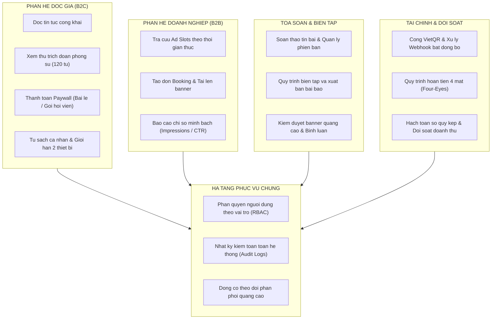

<div align="center">

# LOCALPRESS
### REVENUE & TRUST PLATFORM
*Nền tảng Báo chí Dữ liệu Địa phương — Mô hình Doanh thu Tự chủ & Tòa soạn Số*  
Đại học FPT • Khóa luận SWP391 • Học kỳ Fall 2026 • Nhóm 2  
Bối cảnh triển khai: Thành phố Hải Phòng

---

[](https://spring.io/projects/spring-boot)
[](https://www.oracle.com/java/)
[](https://react.dev/)
[](https://www.typescriptlang.org/)
[](https://vitejs.dev/)
[](https://tailwindcss.com/)
[](https://www.mysql.com/)
[](https://vitest.dev/)

---

[ Mục I. Tổng quan ] &nbsp;•&nbsp; [ Mục II. Kiến trúc nghiệp vụ ] &nbsp;•&nbsp; [ Mục III. Phân vai trách nhiệm ] &nbsp;•&nbsp; [ Mục IV. Tài khoản khảo sát ] &nbsp;•&nbsp; [ Mục V. Cấu trúc mã nguồn ] &nbsp;•&nbsp; [ Mục VI. Hướng dẫn vận hành ]

</div>

---

## I. TỔNG QUAN NỀN TẢNG

LocalPress được xây dựng nhằm giải quyết bài toán cốt lõi của các cơ quan báo chí địa phương hiện nay: Tự chủ nguồn thu tài chính mà không làm suy giảm tính độc lập biên tập và sự tín nhiệm của độc giả. Nền tảng thiết lập mô hình doanh thu kép cân bằng:

1. **B2C — Paywall nội dung chuyên sâu:**  
   Độc giả tiếp cận tin tức thời sự hàng ngày hoàn toàn miễn phí. Các tuyến bài điều tra độc quyền, phóng sự dài kỳ và phân tích kinh tế cảng biển chuyên sâu được bảo vệ bởi tường phí (Paywall). Hệ thống cung cấp cơ chế đọc thử 120 từ mở đầu (lead-in preview), lựa chọn mua lẻ từng bài viết (15.000 VND) hoặc đăng ký gói độc giả dài hạn (Tháng, Quý, Năm). Mỗi tài khoản được kiểm soát phiên truy cập trên tối đa 2 thiết bị đồng thời.

2. **B2B — Cổng quảng cáo tự phục vụ (Self-service Ad Booking):**  
   Cộng đồng doanh nghiệp địa phương (logistics, bất động sản, công nghiệp phụ trợ) chủ động tra cứu vị trí hiển thị (Ad Slots) theo thời gian thực, lựa chọn thời lượng, tải lên tư liệu quảng cáo (banner) và hoàn tất hợp đồng trực tuyến. Hệ thống cung cấp bảng thống kê minh bạch về lượt hiển thị (Impressions), lượt nhấp (Clicks) và tỷ lệ tương tác (CTR).

3. **Quản trị tòa soạn & Kiểm duyệt đa tầng:**  
   Phóng viên biên soạn bài viết trên giao diện hỗ trợ Markdown và văn bản đa định dạng, lưu trữ lịch sử sửa đổi qua từng phiên bản (Version History). Thư ký tòa soạn và ban biên tập kiểm soát quy trình thẩm định trước khi phát hành, đồng thời duyệt chất lượng banner quảng cáo B2B và kiểm duyệt bình luận của độc giả.

4. **Tài chính minh bạch & Kiểm soát rủi ro:**  
   Hệ thống tích hợp thanh toán ngân hàng qua mã VietQR và cơ chế phản hồi tự động Webhook (xử lý Idempotent chống trùng lặp giao dịch). Quy trình hoàn tiền tuân thủ nghiêm ngặt nguyên tắc 4 mắt (Four-Eyes Principle: nhân viên tài chính đề xuất, kế toán trưởng phê duyệt), tự động hạch toán sổ cái kép (General Ledger) và đối soát doanh thu theo từng kỳ kế toán.

---

## II. KIẾN TRÚC NGHIỆP VỤ



---

## III. PHÂN CHIA TRÁCH NHIỆM (MA TRẬN RACI)

Dự án được phân rã thành 5 phân hệ chuyên biệt. Mỗi thành viên chịu trách nhiệm trọn vẹn từ giao diện người dùng (Frontend), logic nghiệp vụ (Backend) đến lược đồ cơ sở dữ liệu (Database):

| Thành viên | Vai trò | Phân hệ phụ trách | Trọng tâm kỹ thuật & Nghiệp vụ |
|:---|:---:|:---|:---|
| **SV4: Huy** | Trưởng nhóm | **Tài chính & Thanh toán** | Cổng VietQR, Webhook IPN xử lý bất đồng bộ, cơ chế Idempotent chống ghi nhận trùng giao dịch. Quy trình hoàn tiền 4 mắt (Four-Eyes Principle), sổ quỹ kép (General Ledger), đối soát định kỳ. |
| **SV1: Tây** | Thành viên | **Doanh nghiệp & Quảng cáo B2B** | Ma trận tra cứu vị trí quảng cáo theo thời gian thực (chống trùng lịch). Quy trình tạo đơn booking, tải bản thiết kế banner. Báo cáo phân tích chiến dịch: Impressions, Clicks, CTR theo thời gian. |
| **SV2: Trọng Phan** | Thành viên | **Tòa soạn & Kiểm duyệt CMS** | Trình soạn thảo bài viết đa phương tiện, lưu trữ lịch sử chỉnh sửa (Version History). Luồng kiểm duyệt phóng viên $\rightarrow$ biên tập viên $\rightarrow$ xuất bản. Kiểm duyệt banner và bình luận độc giả. |
| **SV3** | Thành viên | **Độc giả & Nội dung B2C** | Giao diện đọc báo, chuyên mục, tìm kiếm bài viết. Cơ chế Paywall mở đoạn trích 120 từ, quy trình mua bài và đăng ký gói độc giả. Tủ sách cá nhân, lịch sử đọc và giới hạn 2 thiết bị. |
| **SV5** | Thành viên | **Quản trị hệ thống & Giám sát** | Quản lý người dùng, ma trận phân quyền dựa trên vai trò (RBAC). Hệ thống nhật ký kiểm toán (Audit Logs) phục vụ truy vết an ninh. Giám sát trạng thái phân phối quảng cáo trực tuyến. |

---

## IV. DANH MỤC TÀI KHOẢN KHẢO SÁT HỆ THỐNG

Giao diện tích hợp thanh điều hướng vai trò (Role Switcher Bar) tại cạnh đáy màn hình. Người đánh giá có thể chuyển đổi trực tiếp giữa các vai trò để kiểm thử toàn diện các luồng nghiệp vụ:

| Phân hệ | Mã định danh | Tên hiển thị | Vai trò hệ thống | Phạm vi trải nghiệm chính |
|:---|:---|:---|:---|:---|
| Khách | `user-guest` | Khách vãng lai | GUEST | Đọc tin mở, đọc thử 120 từ bài Paywall, quan sát thông báo giới hạn nội dung. |
| Độc giả | `user-reader-free` | Nguyễn Văn An | READER | Độc giả thông thường, sử dụng bookmark, lưu lịch sử đọc, đặt mua bài viết lẻ. |
| Độc giả VIP | `user-reader-premium` | Trần Thị Mai | READER (VIP) | Độc giả sở hữu Gói Năm VIP, truy cập toàn văn mọi phóng sự điều tra chuyên sâu. |
| Doanh nghiệp | `user-adv-1` | Đặng Quang Huy | ADVERTISER | Đại diện Công ty CP Logistics Cảng Hải Phòng: Đặt chỗ banner, theo dõi chỉ số CTR. |
| Doanh nghiệp | `user-adv-2` | Lê Hồng Phong | ADVERTISER | Đại diện Bất động sản Đất Cảng Hải Phòng: Tra cứu hợp đồng, theo dõi chi phí. |
| Tòa soạn | `user-editor` | Nguyễn Văn Biên Tập | EDITOR | Phóng viên soạn bài, lưu trữ bản nháp, nộp duyệt bài viết lên ban thư ký. |
| Tòa soạn | `user-reviewer` | Trần Thị Thư Ký | REVIEWER | Thư ký tòa soạn: Phê duyệt xuất bản bài viết, duyệt bản thiết kế quảng cáo B2B. |
| Kế toán | `user-fin-staff` | Lê Thị Thu Ngân | FINANCE_STAFF | Kế toán viên: Tra cứu đơn hàng VietQR, lập đề xuất hoàn tiền khách hàng. |
| Kế toán | `user-fin-mgr` | Phạm Trưởng Phòng | FINANCE_MANAGER | Kế toán trưởng: Phê duyệt hoàn tiền (nguyên tắc 4 mắt), chốt sổ đối soát kỳ. |
| Quản trị | `user-admin` | Vũ Quản Trị | SYSTEM_ADMIN | Quản trị viên: Thiết lập ma trận RBAC, theo dõi Audit Log, giám sát động cơ phân phối. |

*Ghi chú:* Nút **"Reset"** trên thanh Role Switcher cho phép xóa toàn bộ dữ liệu thao tác tạm thời trong bộ nhớ cục bộ (LocalStorage) và khôi phục về trạng thái dữ liệu mẫu ban đầu.

---

## V. CẤU TRÚC KỸ THUẬT MONOREPO

```text
LocalPress/
├── backend/                                   # Dịch vụ phía máy chủ (Spring Boot 3 + MySQL)
│   ├── pom.xml                                # Khai báo phụ thuộc (JPA, Security, Flyway, JWT, Lombok)
│   └── src/
│       ├── main/
│       │   ├── java/com/localpress/
│       │   │   ├── LocalPressApplication.java # Điểm khởi chạy ứng dụng
│       │   │   ├── identity/                  # Quản lý người dùng, tài khoản & phiên xác thực
│       │   │   ├── reader/                    # Nghiệp vụ tài khoản độc giả B2C
│       │   │   ├── content/                   # Quản lý chuyên mục & nội dung tin bài
│       │   │   ├── editorial/                 # Quy trình biên tập, duyệt bài & kiểm duyệt banner
│       │   │   ├── advertising/               # Quản lý chiến dịch quảng cáo B2B & Ad Slots
│       │   │   ├── finance/                   # Xử lý đơn hàng, VietQR, hoàn tiền, đối soát kỳ
│       │   │   ├── delivery/                  # Động cơ phân phối và ghi nhận tương tác banner
│       │   │   ├── administration/            # Thiết lập hệ thống, ma trận RBAC & Audit Log
│       │   │   └── shared/                    # Thành phần dùng chung (CORS, ApiResponse, Exception)
│       │   └── resources/
│       │       ├── application.yml            # Tham số cấu hình ứng dụng
│       │       ├── application-dev.yml        # Tham số kết nối MySQL môi trường phát triển
│       │       └── db/migration/              # Kịch bản Flyway (V1 Lược đồ bảng + V2 Dữ liệu mẫu)
│       └── test/java/com/localpress/
│
└── frontend/                                  # Giao diện người dùng (React 19 + TypeScript + Vite)
    ├── package.json
    ├── vite.config.ts
    └── src/
        ├── app/                               # Cấu hình bộ định tuyến (Router) và Provider
        ├── layouts/                           # 4 Khu vực bố cục: Public, Reader, Advertiser, Backoffice
        ├── components/                        # Thành phần giao diện dùng chung (UI Atoms & Shared)
        ├── features/                          # Tổ chức mã nguồn theo miền nghiệp vụ
        │   ├── identity/                      # Đăng nhập, đăng ký, khôi phục mật khẩu
        │   ├── reader/                        # Trang chủ báo, chi tiết bài, Paywall modal, giỏ hàng
        │   ├── advertising/                   # Bảng điều khiển B2B, tra cứu Slot, tạo Booking, báo cáo CTR
        │   ├── editorial/                     # CMS soạn bài, danh sách bài, duyệt bài, duyệt banner
        │   ├── finance/                       # Bảng điều khiển kế toán, quản lý đơn, hoàn tiền, sổ quỹ
        │   └── administration/                # Quản trị tài khoản, phân quyền RBAC, giám sát phân phối
        ├── lib/                               # Bộ điều hợp HTTP, hàm định dạng tiền tệ và thời gian
        ├── mocks/                             # Bộ xử lý Mock API và kho lưu trữ trạng thái cục bộ
        └── tests/                             # Bộ kiểm thử nghiệp vụ tự động (Vitest)
```

---

## VI. HƯỚNG DẪN THIẾT LẬP VÀ VẬN HÀNH

### 1. Vận hành Phân hệ Frontend (React 19 + Vite)

Frontend hỗ trợ cơ chế song hành (Dual-Mode): Mặc định vận hành với Mock API nội bộ có khả năng duy trì trạng thái dữ liệu (Stateful LocalStorage), cho phép trải nghiệm đầy đủ toàn bộ luồng nghiệp vụ độc lập mà không bắt buộc khởi chạy máy chủ backend.

```bash
# Di chuyển vào thư mục frontend
cd frontend

# Cài đặt các gói phụ thuộc
npm install

# Khởi động máy chủ phát triển
npm run dev

# Thực thi bộ kiểm thử nghiệp vụ tự động
npm run test
```

- Điểm truy cập giao diện: `http://localhost:5173`
- *Kết nối với Backend Spring Boot thật:* Thiết lập biến môi trường `VITE_USE_MOCK_API=false` tại file `.env` hoặc cấu hình trong file `src/app/config.ts`.

### 2. Vận hành Phân hệ Backend (Spring Boot 3 + MySQL)

Yêu cầu kỹ thuật: Đã cài đặt Java Development Kit (JDK phiên bản 17 hoặc 21) và máy chủ cơ sở dữ liệu MySQL phiên bản 8.0 trở lên.

```bash
# Di chuyển vào thư mục backend
cd backend

# Khởi chạy ứng dụng với Maven
mvn spring-boot:run
```

- Điểm truy cập REST API: `http://localhost:8080/api/v1`
- Cấu hình CORS đã mở sẵn cho các nguồn: `http://localhost:5173`, `http://localhost:3000`.
- Cơ chế Flyway Migration sẽ tự động kích hoạt tạo cấu trúc bảng (`V1__create_tables.sql`) và nạp dữ liệu mẫu ban đầu (`V2__insert_seed_data.sql`).
