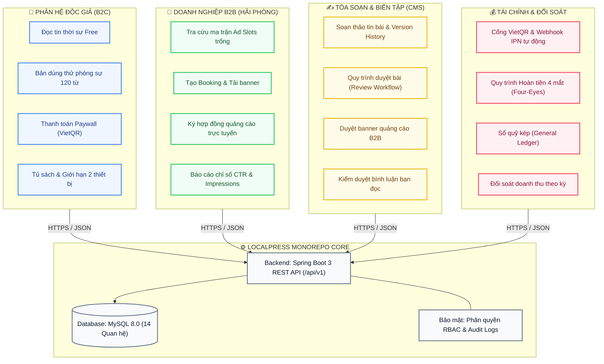
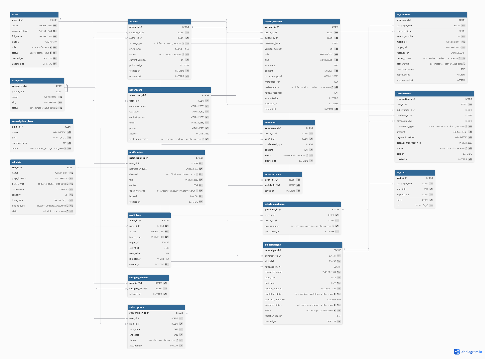
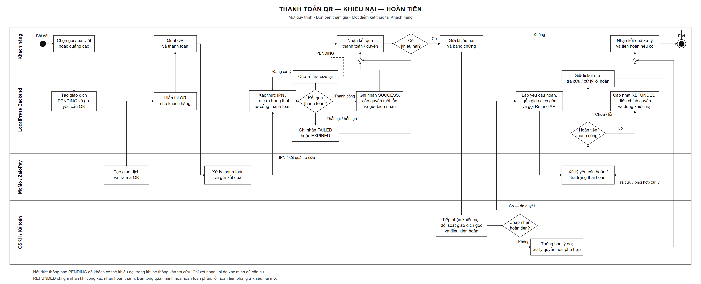
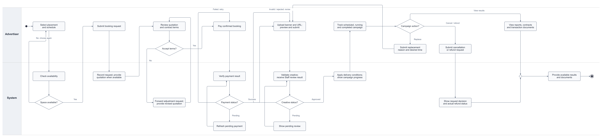

<div align="center">


# 📰 LocalPress — Revenue & Trust Platform
### Nền tảng Báo chí Dữ liệu Địa phương & Hệ sinh thái Doanh thu Tự chủ

[](LOCALPRESS_MASTER_ROADMAP.md)
[](https://hanoi.fpt.edu.vn/)
[-8B5CF6?style=for-the-badge&logo=githubsponsors&logoColor=white)](#-3-đội-ngũ--ma-trận-phân-công-raci)
[](#-1-tổng-quan-dự-án)

<br/>

[](https://spring.io/projects/spring-boot)
[](https://www.oracle.com/java/)
[](https://react.dev/)
[](https://www.typescriptlang.org/)
[](https://vitejs.dev/)
[](https://tailwindcss.com/)
[](https://www.mysql.com/)
[-729B1B?style=flat-square&logo=vitest&logoColor=white)](https://vitest.dev/)

<br/>

**[⚡ Khởi chạy nhanh](#-6-hướng-dẫn-cài-đặt--khởi-chạy)** • **[🏛️ Sơ đồ Kiến trúc & ERD](#-2-kiến-trúc-hệ-thống--sơ-đồ-nghiệp-vụ)** • **[👥 Phân vai SV1-SV5](#-3-đội-ngũ--ma-trận-phân-công-raci)** • **[🔑 Tài khoản Demo](#-4-tài-khoản-thử-nghiệm-demo-personas)** • **[📈 Tiến độ Iteration](#-5-tiến-độ-thực-hiện-swp391-milestones)**

---

</div>

## 📌 1. TỔNG QUAN DỰ ÁN

**LocalPress** được xây dựng nhằm giải quyết bài toán cốt tử của báo chí địa phương hiện nay: **Mất cân đối thu - chi do phụ thuộc vào quảng cáo rác mạng lưới và sụt giảm nguồn thu truyền thống.**

Nền tảng thí điểm tại thị trường **TP. Hải Phòng** (trọng điểm công nghiệp cảng biển & logistics phía Bắc) với mô hình **kinh tế kép**:

<table>
  <tr>
    <td width="50%" valign="top">
      <h3>💎 B2C — Paywall Độc Giả</h3>
      <ul>
        <li><b>Đọc báo mở:</b> Tin tức thời sự, chính trị, văn hóa công khai 100% miễn phí.</li>
        <li><b>Phóng sự điều tra độc quyền:</b> Khóa Paywall thông minh (đọc thử 120 từ mở đầu).</li>
        <li><b>Thanh toán linh hoạt:</b> Mua lẻ từng bài (15.000 ₫) hoặc gói thuê bao Tháng / Quý / Năm.</li>
        <li><b>Bảo vệ bản quyền:</b> Giới hạn đăng nhập đồng thời tối đa 2 thiết bị.</li>
      </ul>
    </td>
    <td width="50%" valign="top">
      <h3>📈 B2B — Quảng Cáo Doanh Nghiệp</h3>
      <ul>
        <li><b>Cổng tự phục vụ (Self-service):</b> Doanh nghiệp chủ động tra cứu vị trí trống (Ad Slots).</li>
        <li><b>Booking thời gian thực:</b> Kiểm tra lịch đặt chỗ thông minh, chống trùng lịch (Conflict-free).</li>
        <li><b>Kiểm duyệt banner:</b> Quy chuẩn kích thước tự động, duyệt qua thư ký tòa soạn.</li>
        <li><b>Minh bạch chỉ số:</b> Báo cáo Impressions, Clicks và tỷ lệ CTR thực tế.</li>
      </ul>
    </td>
  </tr>
  <tr>
    <td width="50%" valign="top">
      <h3>✍️ Tòa Soạn Số & CMS Đa Cấp</h3>
      <ul>
        <li><b>Biên tập đa phương tiện:</b> Trình soạn thảo chuyên dụng cho phóng viên.</li>
        <li><b>Lịch sử phiên bản (Version History):</b> So sánh và hoàn tác từng lần chỉnh sửa.</li>
        <li><b>Quy trình xuất bản:</b> Bản nháp $\rightarrow$ Chờ duyệt $\rightarrow$ Xuất bản.</li>
        <li><b>Kiểm duyệt bình luận:</b> Bộ lọc từ khóa nhạy cảm và phê duyệt tương tác.</li>
      </ul>
    </td>
    <td width="50%" valign="top">
      <h3>🛡️ Tài Chính & Kiểm Soát Rủi Ro</h3>
      <ul>
        <li><b>Thanh toán tức thời:</b> Cổng VietQR động sinh mã kèm nội dung giao dịch.</li>
        <li><b>Webhook IPN Idempotent:</b> Cập nhật trạng thái tự động, chống cộng tiền 2 lần.</li>
        <li><b>Nguyên tắc 4 mắt (Four-Eyes Principle):</b> Kế toán viên lập đề xuất $\rightarrow$ Kế toán trưởng duyệt hoàn tiền.</li>
        <li><b>Sổ quỹ kế toán kép:</b> Hạch toán minh bạch từng kỳ đối soát doanh thu.</li>
      </ul>
    </td>
  </tr>
</table>

---

## 🏛️ 2. KIẾN TRÚC HỆ THỐNG & SƠ ĐỒ NGHIỆP VỤ

### 2.1. Luồng vận hành tổng thể (System Workflow)



### 2.2. Sơ đồ Cơ sở Dữ liệu Quan hệ (Database ERD — 14 Bảng)

<details>
<summary><b>🔍 Bấm vào đây để xem chi tiết Sơ đồ Thực thể Liên kết (Database Schema Diagram)</b></summary>
<br/>

> Toàn bộ lược đồ CSDL được thiết kế chuẩn hóa 3NF, phân tách rành mạch giữa Identity, Articles, Ad Campaigns, Orders, Ledger và Audit Logs.

<div align="center">
  
</div>

</details>

### 2.3. Sơ đồ Swimlane các Quy trình Cốt lõi

<details>
<summary><b>🔄 Quy trình Thanh toán VietQR & Hoàn tiền 4 Mắt — SV4 Leader</b></summary>
<br/>

<div align="center">
  
</div>

</details>

<details>
<summary><b>🔄 Quy trình Đặt chỗ Quảng cáo & Duyệt Banner B2B — SV1</b></summary>
<br/>

<div align="center">
  
</div>

</details>

---

## 👥 3. ĐỘI NGŨ & MA TRẬN PHÂN CÔNG (RACI)

Nhóm gồm **5 thành viên**, mỗi thành viên sở hữu trọn vẹn 1 phân hệ theo mô hình **End-to-End** (Frontend + Backend REST API + Thiết kế CSDL):

| Thành viên | Vai trò | Phân hệ phụ trách | Điểm nhấn Kỹ thuật & Nghiệp vụ | Trạng thái |
|:---|:---:|:---|:---|:---:|
| **SV4: Huy** | **Leader** | **Tài chính & Thanh toán** | • Cổng VietQR tự động, xử lý Webhook IPN bất đồng bộ.<br/>• Xử lý Checksum HMAC-SHA512 & tính **Idempotent** chống cộng tiền 2 lần.<br/>• Quy trình **Hoàn tiền 4 mắt (Four-Eyes)** & Hạch toán Sổ quỹ kép. | `100% PASS` |
| **SV1: Tây** | Thành viên | **Doanh nghiệp & Quảng cáo B2B** | • Tra cứu ma trận Ad Slots trống theo thời gian thực (chống trùng lịch).<br/>• Tạo hợp đồng booking, upload banner hợp chuẩn kích thước.<br/>• Báo cáo phân tích chiến dịch: Impressions, Clicks, CTR theo ngày. | `100% PASS` |
| **SV2: Trọng Phan** | Thành viên | **Tòa soạn & Kiểm duyệt CMS** | • Soạn thảo bài báo RichText, quản lý lịch sử phiên bản (**Version History**).<br/>• Luồng duyệt bài: Phóng viên soạn $\rightarrow$ Thư ký duyệt $\rightarrow$ Xuất bản.<br/>• Kiểm duyệt banner quảng cáo doanh nghiệp & kiểm duyệt bình luận. | `100% PASS` |
| **SV3** | Thành viên | **Độc giả & Trải nghiệm B2C** | • Giao diện đọc báo công khai, chuyên mục, tìm kiếm bài viết.<br/>• **Cổng Paywall trích đoạn 120 từ**, giỏ hàng thanh toán gói VIP.<br/>• Quản lý tủ sách cá nhân & giới hạn phiên đăng nhập 2 thiết bị. | `100% PASS` |
| **SV5** | Thành viên | **Quản trị Hệ thống & Giám sát** | • Quản lý người dùng, phân quyền theo vai trò (**RBAC Matrix**).<br/>• Nhật ký kiểm toán toàn hệ thống (**Audit Logs**) truy vết bảo mật.<br/>• Giám sát trạng thái phân phối quảng cáo trực tiếp (Ad Delivery Monitor). | `100% PASS` |

---

## 🔑 4. TÀI KHOẢN THỬ NGHIỆM (DEMO PERSONAS)

Để giảng viên và hội đồng kiểm thử nhanh mà không cần tạo tài khoản hay gõ mật khẩu, ứng dụng tích hợp thanh **Role Switcher Bar** nằm cố định ở góc dưới màn hình. Click chọn tài khoản tương ứng để đổi vai trò ngay lập tức:

<table>
  <thead>
    <tr>
      <th align="center">Phân hệ</th>
      <th>Mã tài khoản</th>
      <th>Tên hiển thị</th>
      <th>Vai trò</th>
      <th>Trải nghiệm & Luồng kiểm thử chính</th>
    </tr>
  </thead>
  <tbody>
    <tr>
      <td align="center">🌐 <b>Khách</b></td>
      <td><code>user-guest</code></td>
      <td>Khách vãng lai</td>
      <td><code>GUEST</code></td>
      <td>Đọc tin thường, đọc thử đoạn trích 120 từ bài Paywall, nhận thông báo yêu cầu đăng nhập.</td>
    </tr>
    <tr>
      <td align="center">👤 <b>Độc giả Free</b></td>
      <td><code>user-reader-free</code></td>
      <td>Nguyễn Văn An</td>
      <td><code>READER</code></td>
      <td>Đã có tài khoản, lưu bài viết yêu thích, lịch sử đọc, thử nghiệm mua lẻ 1 bài báo (15k).</td>
    </tr>
    <tr>
      <td align="center">⭐ <b>Độc giả VIP</b></td>
      <td><code>user-reader-premium</code></td>
      <td>Trần Thị Mai</td>
      <td><code>READER (VIP)</code></td>
      <td>Sở hữu Gói Hội Viên Năm, đọc toàn quyền mọi phóng sự điều tra, không bị quảng cáo xen kẽ.</td>
    </tr>
    <tr>
      <td align="center">🚢 <b>Doanh nghiệp 1</b></td>
      <td><code>user-adv-1</code></td>
      <td>Đặng Quang Huy</td>
      <td><code>ADVERTISER</code></td>
      <td>Đại diện <i>Logistics Cảng Hải Phòng</i>: Tra cứu slot Lạch Huyện, đặt chỗ, xem báo cáo CTR.</td>
    </tr>
    <tr>
      <td align="center">🏢 <b>Doanh nghiệp 2</b></td>
      <td><code>user-adv-2</code></td>
      <td>Lê Hồng Phong</td>
      <td><code>ADVERTISER</code></td>
      <td>Đại diện <i>BĐS Đất Cảng Hải Phòng</i>: Quản lý danh sách hợp đồng, chi phí và lịch sử hóa đơn.</td>
    </tr>
    <tr>
      <td align="center">✍️ <b>Phóng viên</b></td>
      <td><code>user-editor</code></td>
      <td>Nguyễn Văn Biên Tập</td>
      <td><code>EDITOR</code></td>
      <td>Soạn thảo bài viết mới, chỉnh sửa bản nháp, nộp duyệt bài lên Thư ký tòa soạn.</td>
    </tr>
    <tr>
      <td align="center">📰 <b>Thư ký tòa soạn</b></td>
      <td><code>user-reviewer</code></td>
      <td>Trần Thị Thư Ký</td>
      <td><code>REVIEWER</code></td>
      <td>Phê duyệt xuất bản bài viết, duyệt thiết kế banner quảng cáo B2B của doanh nghiệp.</td>
    </tr>
    <tr>
      <td align="center">🧾 <b>Kế toán viên</b></td>
      <td><code>user-fin-staff</code></td>
      <td>Lê Thị Thu Ngân</td>
      <td><code>FINANCE_STAFF</code></td>
      <td>Tra cứu đơn hàng VietQR, xác nhận biên nhận, <b>khởi tạo đề xuất hoàn tiền</b>.</td>
    </tr>
    <tr>
      <td align="center">💼 <b>Kế toán trưởng</b></td>
      <td><code>user-fin-mgr</code></td>
      <td>Phạm Trưởng Phòng</td>
      <td><code>FINANCE_MANAGER</code></td>
      <td><b>Phê duyệt hoàn tiền (nguyên tắc 4 mắt)</b>, chốt sổ quỹ kép và đóng kỳ đối soát.</td>
    </tr>
    <tr>
      <td align="center">⚡ <b>Quản trị viên</b></td>
      <td><code>user-admin</code></td>
      <td>Vũ Quản Trị</td>
      <td><code>SYSTEM_ADMIN</code></td>
      <td>Cấu hình Paywall, phân quyền tài khoản, theo dõi Audit Log và giám sát Ad Delivery.</td>
    </tr>
  </tbody>
</table>

> [!TIP]
> **Nút Reset Dữ Liệu:** Nằm ngay trên thanh Role Switcher. Bấm **"Reset"** bất kỳ lúc nào để khôi phục toàn bộ dữ liệu về trạng thái ban đầu của TP. Hải Phòng (xóa bỏ dữ liệu rác thao tác thử).

---

## 📈 5. TIẾN ĐỘ THỰC HIỆN (SWP391 MILESTONES)

```text
[■■■■■■■■■■■■■■■■■■■■■■■■■■■■■■□□] 75% Hoàn thành toàn khóa
```

- [x] **Iteration 1 — Khởi động & Đặc tả yêu cầu:** Hoàn thành SRS 100%, ma trận 7 luồng nghiệp vụ cốt lõi, danh mục 30+ ca sử dụng.
- [x] **Iteration 2 — Thiết kế Kiến trúc & Frontend tương tác:** Hoàn thành SDS, CSDL 14 bảng, giao diện hoàn chỉnh 4 phân hệ (React 19 + Vitest 11/11 Passed).
- [ ] **Iteration 3 — Tích hợp Backend REST API & Cổng VietQR:** Khung Spring Boot 3 đã dựng sẵn, kết nối MySQL, hiện thực hóa các API Controller và Security Filter.
- [ ] **Iteration 4 — Tối ưu hóa, Triển khai & Bảo vệ Capstone:** Tối ưu hóa hiệu năng, bảo mật API, nghiệm thu và thuyết trình trước Hội đồng chuyên môn ĐH FPT.

---

## ⚡ 6. HƯỚNG DẪN CÀI ĐẶT & KHỞI CHẠY

Dự án được cấu trúc theo dạng **Monorepo** gồm `frontend/` và `backend/`:

```text
LocalPress/
├── backend/                  # Spring Boot 3.3.4 (Java 17) + MySQL 8.0
│   ├── pom.xml
│   └── src/main/java/com/localpress/
└── frontend/                 # React 19 + TypeScript + Vite + Tailwind
    ├── package.json
    └── src/
```

### 6.1. Khởi chạy Frontend (React 19 + Vite)
Frontend hỗ trợ chế độ **Mock API Stateful** tự lưu trữ trên LocalStorage. Bạn có thể khởi chạy và trải nghiệm ngay mà chưa bắt buộc phải cài đặt backend:

```bash
# Bước 1: Di chuyển vào thư mục frontend
cd frontend

# Bước 2: Cài đặt thư viện phụ thuộc
npm install

# Bước 3: Khởi chạy môi trường phát triển
npm run dev
```

🌐 **Truy cập ứng dụng:** [`http://localhost:5173`](http://localhost:5173)

```bash
# Kiểm thử nghiệp vụ tự động (Vitest)
npm run test
```
*Kết quả kiểm thử: `11/11 tests passed (100%)` bảo đảm đúng logic Paywall, Phân quyền và Bảo mật dữ liệu riêng tư giữa các doanh nghiệp.*

### 6.2. Khởi chạy Backend (Spring Boot 3 + MySQL)
Yêu cầu: Máy đã cài đặt **Java 17 (hoặc 21)** và máy chủ **MySQL 8.0**.

```bash
# Bước 1: Di chuyển vào thư mục backend
cd backend

# Bước 2: Khởi chạy Spring Boot
mvn spring-boot:run
```

- **API Base Endpoint:** `http://localhost:8080/api/v1`
- **Flyway:** Tự động kích hoạt tạo 14 bảng dữ liệu (`V1`) và nạp bộ dữ liệu mẫu Hải Phòng (`V2`).
- **CORS:** Đã cấu hình cho phép giao tiếp với Frontend tại cổng `5173`.

> [!NOTE]
> Để chuyển Frontend từ chế độ Mock sang kết nối Backend Spring Boot thật:  
> Mở file `.env` trong thư mục `frontend/` và đặt: `VITE_USE_MOCK_API=false`.

---

## 📚 7. TÀI LIỆU QUẢN TRỊ DỰ ÁN
Mọi thông tin chi tiết về sơ đồ tuần tự (Sequence Diagrams), hợp đồng API (Swagger/OpenAPI Spec), từ điển dữ liệu (Data Dictionary) và các kịch bản vấn đáp bảo vệ đồ án được ghi nhận tại:  
👉 **[LOCALPRESS_MASTER_ROADMAP.md](LOCALPRESS_MASTER_ROADMAP.md)**

<br/>

<div align="center">
  <sub>Đồ án môn học SWP391 — Đại học FPT Hà Nội — Nhóm 2 — Học kỳ FALL 2026</sub>
</div>
