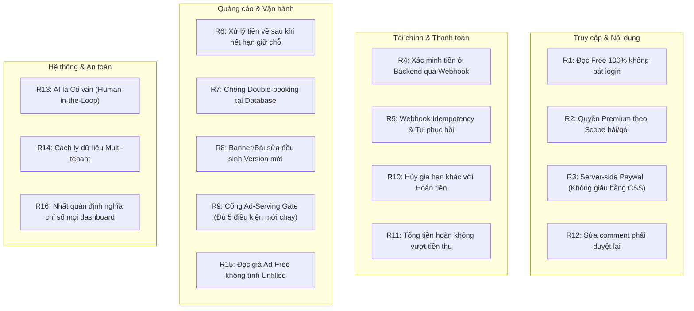
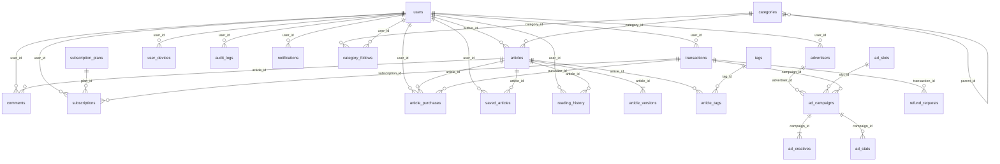
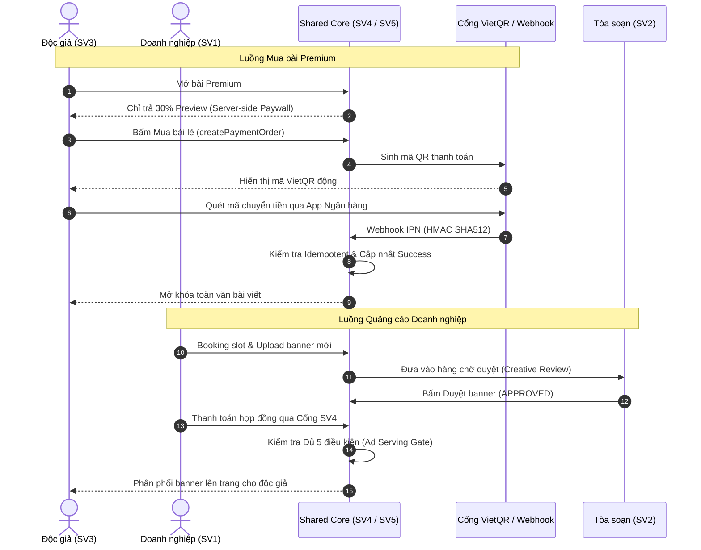

# ĐẶC TẢ NGỮ CẢNH HỆ THỐNG & KIẾN TRÚC TOÀN DIỆN (SYSTEM CONTEXT & MASTER ARCHITECTURE)
> **Dự án:** LocalPress — Revenue & Trust Platform (Báo điện tử cấp tỉnh: Doanh thu tự chủ & Kiểm duyệt tin cậy)  
> **Khóa học:** SWP391 — Học kỳ FALL 2026 — Đại học FPT  
> **Nhóm thực hiện:** Nhóm 2 (Leader: SV4 — Huy)  
> **Phiên bản:** 2.0 (Tích hợp danh mục 125 chức năng chuẩn từ `LocalPress_Danh_muc_chuc_nang.xlsx`)

---

## 1. TỔNG QUAN HỆ THỐNG & BỐI CẢNH DỰ ÁN

### 1.1. Bối cảnh báo điện tử địa phương (TP. Hải Phòng)
Các tòa soạn báo địa phương tại Việt Nam đang đối mặt với thách thức sống còn: ngân sách nhà nước cắt giảm, nguồn thu quảng cáo hiển thị truyền thống bị thâu tóm bởi các nền tảng xuyên biên giới (Google, Meta), độc giả ngày càng khó tính và tình trạng tin giả tràn lan trên mạng xã hội.

**LocalPress** ra đời như một nền tảng chuyển đổi số toàn diện cho báo chí cấp tỉnh (lấy bối cảnh thực tiễn tại TP. Hải Phòng - trung tâm kinh tế biển và logistics lớn nhất miền Bắc):
* **Mô hình Doanh thu kép (Hybrid Revenue Model):** Kết hợp tự động hóa bán vị trí quảng cáo cho doanh nghiệp bản địa (B2B Self-serve Advertising) và thu phí nội dung chất lượng cao từ độc giả trung thành (B2C Premium Content Paywall).
* **Bảo vệ Uy tín Tòa soạn (Trust Platform):** Kiểm duyệt đa tầng với quy trình biên tập nghiêm ngặt, quản lý phiên bản bài viết, kiểm duyệt banner quảng cáo để đảm bảo an toàn thương hiệu và kiểm duyệt bình luận độc giả.
* **Tích hợp Trợ lý Trí tuệ Nhân tạo (AI-Assisted, Human-Mastered):** Ứng dụng AI vào các khâu tốn nhiều thời gian của tòa soạn như sinh gợi ý tiêu đề chuẩn SEO, tóm tắt sapo, gợi ý phân loại chuyên mục và cảnh báo giao dịch bất thường; đồng thời giữ vững nguyên tắc con người là bên đưa ra quyết định duyệt cuối cùng.

---

## 2. HỆ THỐNG 11 VAI TRÒ (SYSTEM ROLES & ACTORS)

Hệ thống được thiết kế phục vụ 11 nhóm tác nhân với ranh giới quyền hạn minh bạch:

| STT | Vai trò (Actor) | Quyền hạn & Mục đích sử dụng chính | Ràng buộc bảo mật & Quy tắc thực tế |
| :---: | :--- | :--- | :--- |
| **1** | **Guest** (Khách vãng lai) | Đọc toàn bộ bài viết Free; xem danh mục, tin nóng, tìm kiếm; xem preview 30% bài Premium; xem bình luận đã được duyệt. | Không yêu cầu đăng ký/đăng nhập. Khi đọc bài Free không bị chặn bởi bất kỳ popup ép login nào. |
| **2** | **Reader** (Độc giả có tài khoản) | Thừa hưởng quyền của Guest; có tủ sách cá nhân (lưu bài, lịch sử đọc, theo dõi chuyên mục), gửi bình luận (chờ duyệt), mua bài lẻ và mua gói. | Xác thực JWT. Được cấu hình quản lý phiên đăng nhập (tối đa 2 thiết bị đồng thời). |
| **3** | **Reader Premium** (Độc giả trả phí) | Đọc toàn văn bài Premium trong phạm vi quyền đã mua (bài lẻ, chuyên mục hoặc toàn trang); hưởng quyền đọc không quảng cáo, nghe audio TTS, tặng bài. | Kiểm tra quyền (Entitlement Check) nghiêm ngặt tại máy chủ theo từng `article_id` hoặc `category_id`. |
| **4** | **Advertiser** (Nhà quảng cáo) | Đăng ký hồ sơ doanh nghiệp; tra cứu vị trí trống (`ad_slots`), đặt chỗ booking, nộp file banner/URL, thanh toán đơn, xem báo cáo hiệu suất (CTR). | Multi-tenant Data Isolation: Tuyệt đối chỉ xem và thao tác trên dữ liệu thuộc doanh nghiệp mình. |
| **5** | **Ad Sales** (Kinh doanh quảng cáo) | Tiếp nhận yêu cầu quảng cáo từ doanh nghiệp; báo giá, lập hợp đồng, nhập booking hộ khách đặt qua điện thoại/chat; theo dõi doanh số. | Được phân công theo danh sách khách hàng phụ trách; theo dõi công nợ cùng bộ phận kế toán. |
| **6** | **Ad Reviewer** (Kiểm duyệt quảng cáo) | Kiểm tra nội dung hình ảnh banner, thông điệp, kích thước và liên kết đích của chiến dịch trước khi chạy; phê duyệt hoặc từ chối kèm lý do. | Phê duyệt theo phiên bản (`ad_creatives.version_number`). Mọi thay đổi của khách phải được duyệt lại. |
| **7** | **Reporter / Writer** (Phóng viên) | Soạn thảo bài viết, đính kèm hình ảnh/media; sử dụng AI hỗ trợ gợi ý tiêu đề/sapo; nộp bài chờ biên tập; sửa bài theo yêu cầu. | Quản lý bản nháp (`DRAFT`). Chỉ nộp được khi đủ thông tin tối thiểu; không tự ý xuất bản bài trực tiếp lên trang. |
| **8** | **Managing Editor** (Tổng biên tập / Trưởng ban) | Phê duyệt bài viết, yêu cầu sửa hoặc từ chối; quyết định xuất bản (`PUBLISHED`); chỉ định bài viết là FREE hay PREMIUM và gắn giá mua lẻ. | Toàn quyền kiểm soát nội dung lên trang; thao tác xuất bản lưu vết audit log đầy đủ. |
| **9** | **Moderator** (Kiểm duyệt cộng đồng) | Tiếp nhận bình luận độc giả ở trạng thái chờ (`PENDING`); duyệt, ẩn hoặc xóa bình luận; xử lý báo cáo vi phạm từ độc giả. | Bình luận đã duyệt nếu độc giả chỉnh sửa sẽ tự động quay về trạng thái `PENDING` để duyệt lại. |
| **10** | **Finance** (Kế toán tài chính) | Giám sát toàn bộ giao dịch dòng tiền; đối soát ngân hàng/cổng thanh toán; xuất biên lai/hóa đơn; xử lý yêu cầu hoàn tiền theo nguyên tắc 4 mắt. | Không trực tiếp can thiệp vào mã thẻ ngân hàng/CVV; quản lý sổ quỹ kép và chốt kỳ đối soát tháng. |
| **11** | **System Admin** (Quản trị hệ thống) | Quản lý người dùng, phân quyền RBAC, cấu hình vị trí quảng cáo, giám sát Ad Delivery, kiểm tra Audit Log an ninh và cấu hình kỹ thuật. | Kiểm soát hệ thống nhưng không xem trộm mật khẩu người dùng (mật khẩu mã hóa BCrypt). |

---

## 3. DANH MỤC 125 CHỨC NĂNG HỆ THỐNG (THE 125 FUNCTIONAL CATALOGUE)

Dự án được chia đều cho 5 sinh viên, mỗi thành viên phụ trách **25 chức năng** (chuẩn hóa theo các mức độ: `[P0]` Cốt lõi, `[P1]` Nâng cấp, `[P2]` Mở rộng):

### 3.1. Phân hệ SV1 — Luồng Doanh nghiệp: Đặt mua và Quản lý Quảng cáo (Tây phụ trách)
*Mục tiêu: Doanh nghiệp tự chủ booking vị trí, biết rõ quyền lợi, quản lý ngân sách và kiểm chứng số liệu minh bạch.*

1. **[P0] SV1_01: Tra cứu vị trí quảng cáo (`ad_slots`).** Xem danh mục vị trí, trang hiển thị (trang chủ, bài viết, chuyên mục), thiết bị hỗ trợ (desktop/mobile), kích thước và đơn giá niêm yết theo ngày.
2. **[P0] SV1_02: Tạo yêu cầu đặt chỗ quảng cáo (Booking).** Chọn vị trí mong muốn, đặt tên chiến dịch, nhập thông tin liên hệ và gửi yêu cầu giữ chỗ.
3. **[P0] SV1_03: Tải lên banner quảng cáo (Creative).** Tải file ảnh banner đúng chuẩn kích thước, nhập URL liên kết đích khi độc giả click vào quảng cáo.
4. **[P0] SV1_04: Chọn lịch chạy và kiểm tra chỗ trống.** Chọn ngày bắt đầu và kết thúc; hệ thống kiểm tra tình trạng kín lịch của slot; giữ chỗ tạm thời có thời hạn hết hiệu lực (vd: 30 phút).
5. **[P0] SV1_05: Thanh toán booking quảng cáo.** Hiển thị tổng tiền, mã đơn, tích hợp bộ thanh toán dùng chung của SV4 (quét VietQR, nhận kết quả tự động).
6. **[P0] SV1_06: Quản lý danh sách hợp đồng & chiến dịch.** Tách biệt hợp đồng thương mại với các chiến dịch vận hành; theo dõi trạng thái chiến dịch (`DRAFT`, `PENDING_REVIEW`, `APPROVED`, `ACTIVE`, `COMPLETED`, `PAUSED`).
7. **[P0] SV1_07: Yêu cầu thay banner đang chạy.** Doanh nghiệp nộp banner mới thay thế bản cũ; hệ thống sinh phiên bản mới và gửi vào hàng duyệt của SV2; bản cũ vẫn chạy cho đến khi bản mới được duyệt.
8. **[P0] SV1_08: Báo cáo hiệu quả chiến dịch theo ngày.** Biểu đồ và bảng số liệu lượt hiển thị (Impressions), lượt click hợp lệ, tỷ lệ CTR và số sự kiện bị loại do trùng lặp/spam.
9. **[P0] SV1_09: Nhận và tải chứng từ thanh toán.** Xem biên nhận thanh toán điện tử, tải hóa đơn tạm tính đúng mã giao dịch của doanh nghiệp mình.
10. **[P1] SV1_10: AI Target Audience — Gợi ý chuyên mục quảng cáo.** Doanh nghiệp nhập sản phẩm (vd: phân bón hữu cơ, du lịch Cát Bà); AI phân tích ngữ nghĩa và gợi ý đặt vào chuyên mục Nông nghiệp Xanh hoặc Du lịch kèm giải thích lý do.
11. **[P0] SV1_11: Quản lý hồ sơ doanh nghiệp.** Cập nhật tên công ty, mã số thuế, địa chỉ trụ sở, người đại diện pháp luật và thông tin xuất hóa đơn.
12. **[P1] SV1_12: Phân quyền nội bộ người đại diện doanh nghiệp.** Cho phép thêm tài khoản nhân viên marketing (chỉ xem báo cáo) hoặc kế toán (xem chứng từ và thanh toán).
13. **[P1] SV1_13: Khai báo mục tiêu chiến dịch.** Đăng ký mục tiêu tăng độ nhận diện thương hiệu hoặc thu hút truy cập; đăng ký từ khóa tiêu cực để tránh hiển thị cạnh tin tức nhạy cảm.
14. **[P0] SV1_14: Xem trước quảng cáo trên giao diện thực tế (Mock Preview).** Trực quan hóa banner trên khung mẫu báo điện tử giao diện desktop và mobile trước khi nộp duyệt.
15. **[P0] SV1_15: Xem bảng báo giá và chiết khấu.** Tính toán tổng chi phí dựa trên số ngày, đơn giá slot và chính sách giảm giá; khóa bảng giá tại thời điểm xác nhận.
16. **[P0] SV1_16: Xác nhận báo giá và điều khoản dịch vụ.** Doanh nghiệp đọc và tích chọn đồng ý điều khoản dịch vụ; lưu trữ vết xác nhận điện tử kèm thời gian.
17. **[P1] SV1_17: Theo dõi tiến độ thanh toán nhiều đợt.** Hiển thị tiến trình đặt cọc (50%) và thanh toán phần còn lại; cảnh báo hạn thanh toán để chiến dịch không bị ngắt.
18. **[P0] SV1_18: Theo dõi tiến trình xử lý booking (Workflow Stepper).** Các bước: Gửi yêu cầu $\rightarrow$ Báo giá $\rightarrow$ Thanh toán $\rightarrow$ Duyệt banner $\rightarrow$ Chạy $\rightarrow$ Hoàn thành.
19. **[P1] SV1_19: Đặt gói nhiều vị trí (Cross-slot Package).** Hỗ trợ một chiến dịch đặt cùng lúc banner đầu trang và banner trong bài viết.
20. **[P1] SV1_20: Yêu cầu đổi lịch hoặc vị trí quảng cáo.** Gửi yêu cầu điều chỉnh ngày chạy khi chiến dịch chưa diễn ra; tính toán chênh lệch chi phí phát sinh.
21. **[P1] SV1_21: Trao đổi trực tiếp theo từng booking (Ticket/Chat).** Gửi phản hồi hoặc trao đổi nhanh với nhân viên kinh doanh ngay trên màn hình chi tiết booking.
22. **[P0] SV1_22: Gửi yêu cầu hủy và hoàn tiền.** Nộp yêu cầu hủy hợp đồng quảng cáo kèm lý do; chuyển tiếp hồ sơ sang bộ phận Kế toán SV4 xử lý theo chính sách.
23. **[P0] SV1_23: Trung tâm thông báo doanh nghiệp.** Nhận thông báo tức thời khi banner được duyệt, banner bị từ chối kèm lý do sửa, hoặc khi chiến dịch sắp kết thúc.
24. **[P1] SV1_24: Xuất báo cáo chiến dịch (Export PDF/CSV).** Xuất file báo cáo tổng kết hiệu quả chiến dịch có đóng dấu mộc điện tử và mốc thời gian chốt số liệu.
25. **[P1] SV1_25: Đặt lại chiến dịch cũ (Duplicate Campaign).** Nhân bản cấu hình chiến dịch đã chạy thành công trước đó nhưng kiểm tra lại tính khả dụng của lịch trống.

---

### 3.2. Phân hệ SV2 — Luồng Tòa soạn: Kinh doanh, Kiểm duyệt & Điều hành (Trọng Phan phụ trách)
*Mục tiêu: Đảm bảo vận hành tòa soạn trơn tru, phê duyệt nghiêm ngặt nội dung và tối ưu hóa hiệu quả thương mại.*

1. **[P0] SV2_01: Dashboard doanh thu thương mại tòa soạn.** Thống kê tổng hợp: Giá trị hợp đồng ký kết, số tiền thực thu, công nợ tồn đọng và danh sách công việc khẩn cần xử lý.
2. **[P0] SV2_02: Danh sách booking quảng cáo chờ xử lý.** Bộ lọc theo khách hàng, ngày bắt đầu chạy, trạng thái thanh toán và nhân viên phụ trách; sắp xếp theo độ ưu tiên thời gian.
3. **[P0] SV2_03: Kiểm duyệt banner quảng cáo (Ad Moderation).** Xem hình ảnh, kiểm tra kích thước, quét URL đích, kiểm tra tuân thủ luật quảng cáo; bấm Duyệt hoặc Từ chối kèm ghi chú hướng dẫn sửa.
4. **[P0] SV2_04: Lịch sử dụng vị trí quảng cáo (Inventory Calendar).** Lịch trực quan theo ngày/tuần thể hiện slot nào đang trống, đang giữ chỗ, đã ký hợp đồng hoặc đang chạy.
5. **[P1] SV2_05: Quản lý mã giảm giá (Vouchers/Discounts).** Thiết lập mã voucher khuyến mãi, thời hạn hiệu lực, mức giảm (tiền mặt hoặc %) và số lần sử dụng tối đa.
6. **[P0] SV2_06: Thiết lập quy tắc kết thúc quảng cáo.** Quy định thời điểm hạ banner tự động khi hết hạn hợp đồng; cơ chế dừng hiển thị tức thì.
7. **[P1] SV2_07: Quản lý khách hàng VIP doanh nghiệp.** Phân loại đối tác chiến lược, gắn thẻ ưu đãi chiết khấu riêng; lưu trữ lịch sử hợp tác.
8. **[P1] SV2_08: Báo cáo tỷ lệ khai thác vị trí (Inventory Occupancy).** Báo cáo slot nào bán chạy, slot nào có tỷ lệ trống cao để phòng kinh doanh điều chỉnh chính sách giá.
9. **[P1] SV2_09: Tự động nhắc nhở gia hạn hợp đồng.** Hệ thống sinh việc nhắc nhân viên kinh doanh liên hệ khách hàng trước 3 ngày khi chiến dịch kết thúc.
10. **[P2] SV2_10: AI Price Optimization — Đề xuất tối ưu giá slot.** Phân tích lượng truy cập chuyên mục, mùa vụ và tỷ lệ lấp đầy trong quá khứ để gợi ý mức giá sàn phù hợp; Trưởng ban kinh doanh quyết định áp dụng.
11. **[P0] SV2_11: Soạn thảo và gửi báo giá chính thức.** Nhân viên kinh doanh lập báo giá chi tiết, áp dụng chiết khấu và gửi đường dẫn cho doanh nghiệp xác nhận online.
12. **[P0] SV2_12: Quản lý hợp đồng & phụ lục.** Lưu trữ thông tin điều khoản, mã số hợp đồng, file đính kèm PDF và lịch sử tạo phụ lục thay đổi.
13. **[P1] SV2_13: Đặt quảng cáo hộ doanh nghiệp (Staff Booking).** Nhân viên kinh doanh nhập thay thông tin booking cho khách hàng truyền thống đặt qua điện thoại/gặp trực tiếp.
14. **[P0] SV2_14: Xác nhận đủ điều kiện chạy chiến dịch (Ad Serving Gatekeeper).** Kiểm tra chéo 3 yếu tố: Hợp đồng hợp lệ, tiền đã về (hoặc công nợ bảo lãnh), và banner đã được duyệt.
15. **[P0] SV2_15: Phê duyệt thay đổi banner giữa kỳ.** So sánh trực quan giữa banner cũ đang chạy và banner mới nộp; duyệt thời điểm hoán đổi hiển thị.
16. **[P0] SV2_16: Tạm dừng khẩn cấp quảng cáo (Emergency Kill-Switch).** Cho phép ngắt hiển thị banner ngay lập tức trong trường hợp doanh nghiệp vi phạm pháp luật hoặc link đích bị lỗi.
17. **[P1] SV2_17: Tiếp nhận và xử lý khiếu nại quảng cáo.** Ghi nhận phản ánh từ độc giả hoặc doanh nghiệp về vị trí hiển thị, điều tra log và cập nhật kết quả xử lý.
18. **[P1] SV2_18: Xử lý bù quảng cáo thiếu (Make-good Management).** Khi hệ thống gặp sự cố hạ tầng làm gián đoạn hiển thị, ban điều hành lên lịch bù ngày hoặc bù hiển thị tương đương.
19. **[P2] SV2_19: Quản lý cạnh tranh thương hiệu (Category Exclusivity).** Chặn không cho hai thương hiệu đối thủ cùng ngành xuất hiện đồng thời trên cùng một cụm vị trí.
20. **[P0] SV2_20: Kiểm duyệt bình luận độc giả (Comment Moderation).** Danh sách bình luận chờ duyệt; thao tác duyệt, ẩn, đánh dấu vi phạm hoặc cấm bình luận tài khoản spam.
21. **[P0] SV2_21: Duyệt xuất bản bài viết (Editorial Review).** Tổng biên tập kiểm tra nội dung bài phóng sự, hình ảnh, nguồn tin; duyệt xuất bản (`PUBLISHED`) hoặc trả bài yêu cầu sửa.
22. **[P0] SV2_22: Quản lý chính sách phân loại Free / Premium.** Xác lập danh mục tin thời sự dân sinh luôn miễn phí; chỉ định các bài phóng sự điều tra chuyên sâu là Premium.
23. **[P0] SV2_23: Quản lý danh mục gói đọc báo (`subscription_plans`).** Tạo và cấu hình gói tháng, quý, năm; thiết lập giá bán, số thiết bị cho phép, quyền đọc không quảng cáo và nghe audio.
24. **[P1] SV2_24: Dashboard tỷ lệ chuyển đổi độc giả (Reader Funnel).** Biểu đồ đo lường: Lượt xem bài Free $\rightarrow$ Lượt xem preview $\rightarrow$ Bấm nút mua $\rightarrow$ Thanh toán thành công.
25. **[P2] SV2_25: AI hỗ trợ kiểm duyệt tự động (AI Auto-moderation).** AI gắn nhãn cảnh báo bình luận chứa từ ngữ thù ghét, tục tĩu hoặc banner nghi vấn vi phạm để nhân viên ưu tiên xử lý.

---

### 3.3. Phân hệ SV3 — Luồng Khách & Độc giả: Đọc báo, Cá nhân hóa & Premium (Hoàng phụ trách)
*Mục tiêu: Đọc tin tức địa phương thuận tiện, cá nhân hóa trải nghiệm và mở khóa nội dung chất lượng cao minh bạch.*

1. **[P0] SV3_01: Landing page giới thiệu gói đọc báo Premium.** Bảng so sánh trực quan quyền lợi các gói: Đọc toàn bộ phóng sự độc quyền, không quảng cáo, nghe audio AI, số thiết bị.
2. **[P0] SV3_02: Đăng ký & Đăng nhập tài khoản dùng chung.** Hỗ trợ đăng nhập email/mật khẩu, xác thực OTP, quên mật khẩu; tài khoản dùng chung cho cả độc giả và nhà quảng cáo.
3. **[P0] SV3_03: Màn hình Checkout mua bài lẻ & mua gói.** Chọn phương thức mua bài lẻ (15.000 ₫/bài) hoặc mua gói hội viên; hiển thị rõ thời hạn và quyền lợi trước khi thanh toán.
4. **[P0] SV3_04: Tủ sách cá nhân (Personal Library).** Phân chia rõ 4 tab: "Bài viết đã mua", "Bài viết đã lưu", "Lịch sử đọc gần đây" và "Bài viết được tặng".
5. **[P0] SV3_05: Giao diện đọc báo chất lượng cao (Reader View).** Giao diện responsive trên mobile/desktop, hỗ trợ chế độ đọc ban đêm (Dark Mode), phóng to/thu nhỏ cỡ chữ, mục lục tự động cho bài viết dài.
6. **[P0] SV3_06: Quản lý phiên thiết bị (Device Session Control).** Xem danh sách thiết bị đang đăng nhập; tự động kiểm soát giới hạn tối đa 2 thiết bị đồng thời; hỗ trợ nút "Đăng xuất khỏi thiết bị cũ".
7. **[P1] SV3_07: Quản lý tự động gia hạn gói cước.** Cho phép độc giả bật/tắt tính năng gia hạn định kỳ; hiển thị ngày gia hạn tiếp theo và số tiền dự kiến.
8. **[P0] SV3_08: Lịch sử đơn hàng & giao dịch độc giả.** Xem lại danh sách các giao dịch mua bài/gói cước, trạng thái thanh toán, biên nhận điện tử và tình trạng hoàn tiền.
9. **[P1] SV3_09: Tặng quyền đọc bài viết cho bạn bè (Gift Article).** Tạo liên kết token tặng quyền đọc một bài phóng sự Premium cho người khác theo hạn mức quy định của gói hội viên.
10. **[P1] SV3_10: Đọc báo bằng giọng nói AI (Text-to-Speech Audio).** Nghe bài viết bằng giọng đọc truyền cảm (hỗ trợ giọng Bắc / địa phương chuẩn); thanh điều khiển tua tốc độ đọc 1.25x, 1.5x.
11. **[P0] SV3_11: Trang chủ, chuyên mục & tìm kiếm mở cho Guest.** Đọc tin tức mới nhất, lọc theo chuyên mục (Thời sự, Kinh tế, Nông nghiệp...), tìm kiếm tin theo từ khóa mà không cần tài khoản.
12. **[P0] SV3_12: Đọc toàn bộ bài Free không rào cản.** Không bị chặn bởi form đăng ký; cung cấp nút chia sẻ mạng xã hội và danh sách bài viết liên quan.
13. **[P0] SV3_13: Xem preview bài viết Premium.** Hiển thị 30% nội dung mở đầu, hiển thị hộp giới thiệu giá trị bài viết và nút thanh toán nhanh "Mở khóa chỉ với 15.000 ₫".
14. **[P0] SV3_14: Lịch sử đọc bài & đồng bộ vị trí đọc.** Tự động ghi nhớ vị trí cuộn trang để độc giả đọc tiếp khi quay lại; hỗ trợ xóa lịch sử đọc.
15. **[P0] SV3_15: Đánh dấu bài viết yêu thích (Bookmarks).** Lưu bài viết vào danh sách đọc sau chỉ với một chạm; chống lưu trùng lặp cùng một bài.
16. **[P0] SV3_16: Theo dõi chuyên mục quan tâm (Follow Categories).** Nhận luồng tin tùy biến theo các chủ đề quan tâm (vd: Doanh nghiệp Cảng biển, Nông nghiệp Xanh).
17. **[P1] SV3_17: Trung tâm thông báo cá nhân.** Nhận thông báo bài viết mới thuộc chuyên mục theo dõi, thông báo khi bình luận được duyệt hoặc thông báo gói cước sắp hết hạn.
18. **[P0] SV3_18: Bình luận bài viết có kiểm duyệt.** Độc giả gửi bình luận; giao diện hiển thị trạng thái "Bình luận của bạn đang chờ biên tập viên duyệt".
19. **[P0] SV3_19: Báo cáo bình luận vi phạm & góp ý bài viết.** Nút bấm gửi phản ánh nội dung không phù hợp hoặc báo lỗi sai sót thông tin trong bài viết tới ban biên tập.
20. **[P0] SV3_20: Tùy biến hồ sơ độc giả.** Cập nhật họ tên, ảnh đại diện (avatar), số điện thoại và thay đổi mật khẩu bảo mật.
21. **[P1] SV3_21: Chia sẻ trích dẫn bài viết lên mạng xã hội.** Chọn một đoạn trích dẫn tâm đắc để tự động tạo ảnh trích dẫn đẹp mắt kèm bản quyền tòa soạn để share lên Facebook/Zalo.
22. **[P1] SV3_22: Khảo sát ý kiến độc giả nhanh (Quick Polls).** Tham gia bỏ phiếu khảo sát ý kiến dân sinh tại cuối bài viết và xem ngay kết quả bình chọn tổng hợp.
23. **[P0] SV3_23: Trung tâm hỗ trợ độc giả (Reader Support).** Tra cứu câu hỏi thường gặp (FAQ) về thanh toán, quyền đọc Premium; gửi yêu cầu tra soát nếu gặp lỗi chưa mở được bài.
24. **[P1] SV3_24: Đăng ký nhận bản tin định kỳ qua Email (Newsletter).** Đăng ký nhận email tổng hợp tin tức nổi bật địa phương vào mỗi sáng sớm.
25. **[P2] SV3_25: AI gợi ý bài viết cá nhân hóa (Recommended for You).** Gợi ý các bài viết liên quan dựa trên chuyên mục độc giả đọc nhiều nhất trong 7 ngày gần đây.

---

### 3.4. Phân hệ SV4 — Luồng Kế toán: Thanh toán, Công nợ & Đối soát (Huy - Leader phụ trách)
*Mục tiêu: Đảm bảo toàn vẹn dòng tiền, minh bạch đối soát ngân hàng, xử lý hoàn tiền an toàn và chuẩn hóa sổ quỹ kép.*

1. **[P0] SV4_01: Dashboard tài chính & Dòng tiền tòa soạn.** Tổng hợp: Doanh thu B2C (bán gói/bài lẻ), Doanh thu B2B (quảng cáo), số tiền đã thực thu, tổng công nợ và biểu đồ tăng trưởng doanh thu theo ngày.
2. **[P0] SV4_02: Quản lý danh sách đơn hàng toàn hệ thống (`transactions`).** Xem toàn bộ đơn hàng phát sinh từ cả mua báo lẫn booking quảng cáo; lọc theo trạng thái (`PENDING`, `SUCCESS`, `FAILED`, `REFUNDED`).
3. **[P0] SV4_03: Chi tiết đơn hàng & Lịch sử thanh toán.** Tra cứu chi tiết nguồn gốc đơn hàng, mã tham chiếu cổng thanh toán, thời gian ghi nhận và tài khoản thực hiện.
4. **[P0] SV4_04: Cổng thanh toán VietQR / Sandbox MoMo / VNPay.** Tạo mã QR động kèm thông tin chuyển khoản chuẩn xác (Số tiền, Mã đơn hàng, Ngân hàng thụ hưởng).
5. **[P0] SV4_05: Xử lý Webhook / IPN tự động & Chống trùng (Idempotent IPN).** Lắng nghe tín hiệu thông báo thanh toán thành công từ ngân hàng/cổng thanh toán; kiểm tra chữ ký số bảo mật; chống xử lý cộng tiền hai lần.
6. **[P1] SV4_06: Cấu hình thuế VAT & Phí giao dịch cổng.** Cài đặt tỷ lệ phần trăm thuế VAT và phí chiết khấu cổng thanh toán để tính toán số thu ròng thực tế (Net Revenue).
7. **[P1] SV4_07: Báo cáo phân bổ doanh thu theo chuyên mục.** Thống kê doanh thu mua bài lẻ gắn liền với từng chuyên mục; tính toán hiệu quả kinh tế của từng mảng nội dung.
8. **[P0] SV4_08: Sổ quỹ dòng tiền kép (General Ledger System).** Ghi nhận tự động các bút toán: Nợ/Có khi tiền vào, khi trích phí cổng, khi hoàn tiền; đối chiếu khớp số dư tài khoản.
9. **[P1] SV4_09: Chốt sổ đối soát tài chính theo tháng.** Chức năng khóa sổ kế toán cuối tháng; lưu vết người thực hiện chốt sổ và ngăn chặn sửa đổi chứng từ sau khi đã khóa kỳ.
10. **[P2] SV4_10: AI Fraud Analytics — Cảnh báo thanh toán bất thường.** AI phát hiện các dấu hiệu: Một địa chỉ IP thực hiện thử thẻ quá 5 lần/phút, đơn hàng thanh toán chênh lệch số tiền so với báo giá để gắn cờ cảnh báo kế toán.
11. **[P0] SV4_11: Bộ xử lý thanh toán dùng chung (Shared Payment Core).** Cung cấp API nội bộ cho cả SV1 (Quảng cáo) và SV3 (Mua báo) gọi chung để tạo phiên giao dịch, tra cứu kết quả và hoàn tiền.
12. **[P0] SV4_12: Quản lý công nợ doanh nghiệp quảng cáo (Accounts Receivable).** Theo dõi hạn thanh toán các hợp đồng quảng cáo trả chậm; danh sách doanh nghiệp đến hạn thu nợ; cảnh báo nợ quá hạn.
13. **[P1] SV4_13: Gửi thông báo nhắc nợ tự động.** Gửi email thông báo nhắc thanh toán tiền hợp đồng quảng cáo khi còn 3 ngày, 1 ngày trước hạn.
14. **[P0] SV4_14: Quy trình hoàn tiền theo nguyên tắc 4 mắt (Four-Eyes Refund Workflow).** Nhân viên kế toán 1 lập phiếu đề xuất hoàn tiền $\rightarrow$ Kế toán trưởng / Leader duyệt phiếu $\rightarrow$ Hệ thống thực hiện hoàn tiền và thu hồi quyền đọc bài.
15. **[P0] SV4_15: Cơ chế tự động thử lại cấp quyền (Entitlement Retry Worker).** Khi tiền đã trừ thành công ở ngân hàng nhưng do mạng nghẽn khiến việc kích hoạt quyền đọc bị fail, worker chạy ngầm sẽ tự động thử lại định kỳ mà không bắt khách trả tiền lần 2.
16. **[P1] SV4_16: Nhập sao kê ngân hàng & Đối soát tự động (Reconciliation Engine).** Cho phép tải lên file sao kê ngân hàng (Excel/CSV); hệ thống tự động so khớp mã giao dịch và số tiền giữa sao kê và dữ liệu trong database.
17. **[P1] SV4_17: Xử lý các giao dịch sai lệch (Discrepancy Resolver).** Danh sách các khoản tiền bị thừa, thiếu hoặc chuyển khoản sai nội dung cú pháp để kế toán xử lý thủ công bằng tay.
18. **[P0] SV4_18: Sinh hóa đơn & Chứng từ điện tử.** Tạo file PDF hóa đơn/biên nhận thanh toán có mã tra cứu và thông tin doanh nghiệp hợp lệ.
19. **[P1] SV4_19: Quản lý chính sách giá và chiết khấu thương mại.** Cấu hình bảng biểu chiết khấu theo giá trị hợp đồng (vd: hợp đồng trên 20 triệu giảm 10%).
20. **[P1] SV4_20: Báo cáo chỉ số tài chính định kỳ (MRR / ARR / Churn Rate).** Tính toán doanh thu định kỳ theo tháng (MRR), doanh thu quy đổi năm (ARR) và tỷ lệ hủy thuê bao (Churn).
21. **[P1] SV4_21: Báo cáo phân tích dòng tiền ròng (Net Cashflow Report).** Báo cáo chi tiết: Tiền thu thực tế trừ chi phí cổng thanh toán và tiền đã hoàn lại cho khách hàng.
22. **[P1] SV4_22: Giám sát trạng thái hoạt động của cổng thanh toán (Health Check).** Cảnh báo khi cổng thanh toán VietQR / MoMo gặp sự cố timeout để chuyển hướng sang kênh dự phòng.
23. **[P0] SV4_23: Nhật ký kiểm toán tài chính (Financial Audit Logs).** Ghi lại vĩnh viễn mọi thao tác tạo đơn, duyệt hoàn tiền, chỉnh sửa công nợ kèm danh tính người thực hiện.
24. **[P1] SV4_24: Đối chiếu dòng tiền thực nhận từ cổng thanh toán.** Kiểm tra số tiền cổng thanh toán chuyển về tài khoản thực tế của tòa soạn sau khi đã trừ phí dịch vụ.
25. **[P1] SV4_25: Quản lý hồ sơ khiếu nại giao dịch (Chargeback Cases).** Lưu trữ hồ sơ giải quyết khiếu nại giữa tòa soạn, độc giả và ngân hàng kèm bằng chứng log hệ thống.

---

### 3.5. Phân hệ SV5 — Luồng Hệ thống: CMS, Phân phối Quảng cáo, Paywall & AI Biên tập (Tùng phụ trách)
*Mục tiêu: Đảm bảo an ninh nội dung, kiểm soát quyền truy cập ở tầng máy chủ, tối ưu hóa phân phối quảng cáo và tăng tốc biên tập bằng AI.*

1. **[P0] SV5_01: Cấu hình vị trí quảng cáo (`ad_slots`).** Quản lý mã định danh slot, vị trí trang/chuyên mục, kích thước pixel, loại hiển thị (độc quyền hay chia sẻ xoay vòng) và trạng thái bật/tắt.
2. **[P1] SV5_02: Động cơ xoay vòng banner quảng cáo (Ad Rotation Engine).** Cho phép nhiều banner đã duyệt cùng chia sẻ một slot quảng cáo theo tỷ lệ trọng số hoặc lượt hiển thị công bằng.
3. **[P0] SV5_03: Thiết lập thuộc tính bài viết Free / Premium.** Xác lập thuộc tính truy cập cho từng bài báo; lưu giá bán lẻ và trích xuất đoạn văn preview 30%.
4. **[P0] SV5_04: Thuật toán phát hiện & Lọc click bất thường (Anti-Fraud Click Filter).** Chống gian lận click tặc: Loại bỏ các click liên tiếp từ cùng một IP/User-Agent trong khoảng thời gian ngắn; chỉ ghi nhận click hợp lệ vào thống kê tính tiền.
5. **[P1] SV5_05: Dashboard giám sát hiệu năng kỹ thuật tòa soạn.** Đo lường tốc độ tải trang, độ trễ API, dung lượng ảnh trên CDN và tỷ lệ lỗi phân phối banner.
6. **[P0] SV5_06: Quản lý chính sách Cookie & Quyền riêng tư.** Quản lý banner thông báo cookie; tuân thủ chính sách bảo vệ dữ liệu độc giả; cho phép từ chối theo dõi mà vẫn đọc được tin tức Free.
7. **[P2] SV5_07: A/B Testing hiệu quả hiển thị banner.** Tự động chia đều lưu lượng độc giả 50/50 giữa hai mẫu banner khác nhau của cùng một chiến dịch để đo lường mẫu nào có CTR cao hơn.
8. **[P1] SV5_08: Phân phối quảng cáo theo địa bàn địa phương (Geo-Targeting).** Ưu tiên hiển thị quảng cáo theo khu vực quận/huyện độc giả lựa chọn hoặc địa bàn ước lượng từ mạng; có công cụ mô phỏng địa bàn để kiểm thử.
9. **[P0] SV5_09: Hạ tầng Audit Log dùng chung toàn hệ thống.** Ghi nhận tập trung nhật ký an ninh: Người dùng nào, thực hiện hành động gì, trên đối tượng nào, địa chỉ IP và kết quả thực hiện.
10. **[P0] SV5_10: Động cơ Paywall thực thi ở tầng Máy chủ (Server-side Paywall Engine).** Kiểm tra quyền đọc ở tầng Backend; tuyệt đối không trả toàn văn bài viết về client nếu độc giả chưa mua bài.
11. **[P0] SV5_11: Hệ thống soạn thảo nội dung CMS (Article Editor CMS).** Trình soạn thảo Rich Text (tiêu đề, sapo, nội dung, ảnh chèn, chú thích ảnh, tác giả); hỗ trợ lưu nháp tự động và xem trước bài viết.
12. **[P0] SV5_12: Quản lý phiên bản bài viết (`article_versions`).** Lưu trữ lịch sử mọi lần chỉnh sửa; so sánh sự khác biệt (diff) giữa các phiên bản; hỗ trợ khôi phục phiên bản cũ an toàn.
13. **[P0] SV5_13: Quản lý cây danh mục & Thẻ bài viết (Taxonomy & Tags).** Quản lý chuyên mục phân cấp cha - con; tạo slug đường dẫn chuẩn SEO; quản lý các thẻ tag chủ đề nóng.
14. **[P0] SV5_14: Quy trình gửi duyệt & Phê duyệt bài viết nhiều bước.** Trạng thái bài: `DRAFT` $\rightarrow$ `PENDING` $\rightarrow$ `APPROVED` $\rightarrow$ `PUBLISHED` $\rightarrow$ `ARCHIVED`.
15. **[P0] SV5_15: Thư viện quản lý tệp tin truyền thông (Media Assets Library).** Quản lý hình ảnh, banner; tối ưu hóa dung lượng ảnh tự động; gắn thẻ bản quyền và alt-text mô tả ảnh.
16. **[P0] SV5_16: Quản trị người dùng & Phân quyền RBAC.** Tạo tài khoản, gán vai trò (`READER`, `AUTHOR`, `EDITOR`, `STAFF`, `ADVERTISER`, `SYSTEM_ADMIN`); khóa tài khoản khi có vi phạm.
17. **[P0] SV5_17: Động cơ lựa chọn quảng cáo tối ưu (Ad Selection Engine).** Thuật toán tìm kiếm banner phù hợp nhất theo slot, thời gian thực, trạng thái duyệt và ngân sách còn lại; tự động hiển thị banner mặc định của tòa soạn nếu slot trống.
18. **[P0] SV5_18: Thu thập & Tổng hợp sự kiện Impression/Click.** API nhận sự kiện hiển thị và click; lưu vào bảng `ad_stats`; cung cấp dữ liệu báo cáo thống nhất cho cả doanh nghiệp và tòa soạn.
19. **[P1] SV5_19: Giám sát URL đích của quảng cáo sau khi duyệt.** Tự động kiểm tra định kỳ liên kết đích của banner; nếu link bị chết (404/500) hoặc chuyển hướng sang web độc hại thì tạm dừng và cảnh báo.
20. **[P0] SV5_20: Quản lý tác vụ ngầm & Lên lịch xuất bản (Background Scheduler).** Tự động xuất bản bài viết theo giờ hẹn trước; tự động cập nhật thống kê doanh thu và chỉ số cuối ngày.
21. **[P0] SV5_21: AI Trợ lý biên tập — Gợi ý tiêu đề bài viết.** AI phân tích toàn văn bài phóng sự, sinh 3 phương án tiêu đề: Tiêu đề phong cách chính luận, tiêu đề chuẩn SEO Google và tiêu đề ngắn gọn cho mobile.
22. **[P1] SV5_22: AI Trợ lý biên tập — Sinh đoạn tóm tắt Sapo & Gợi ý Tag.** Tự động tóm tắt 2-3 câu ngắn gọn cho sapo bài viết và gợi ý 5 thẻ tag chuyên đề phù hợp với nội dung.
23. **[P0] SV5_23: Giám sát & Quản lý chi phí gọi AI (AI Usage Guardrails).** Lưu trữ lịch sử gọi AI, kiểm soát thời gian phản hồi (timeout fallback sang nhập tay), lưu phiên bản văn bản đưa vào và kết quả sinh ra.
24. **[P1] SV5_24: Chế độ thông tin khẩn cấp địa phương (Emergency Alert Mode).** Tính năng ghim thông báo khẩn cấp (bão lũ, thiên tai, dịch bệnh) lên đầu toàn bộ các trang và tạm thời ưu tiên nội dung tin tức dân sinh.
25. **[P1] SV5_25: Cấu hình vận hành & Sao lưu dữ liệu (Backup & Health).** Sao lưu cơ sở dữ liệu định kỳ; cấu hình biến môi trường an toàn; trang hiển thị chế độ bảo trì hệ thống.

---

## 4. 16 QUY TẮC NGHIỆP VỤ BẤT BIẾN (INVARIANT BUSINESS RULES)

Để hệ thống hoạt động ổn định và không xảy ra mâu thuẫn giữa 5 phân hệ, toàn bộ kiến trúc phải tuân thủ 16 quy tắc cốt lõi:



### Chi tiết 16 quy tắc:
1. **Đọc Free không cần tài khoản:** Độc giả vãng lai (Guest) có thể đọc 100% bài viết Free mà không bị bắt ép tạo tài khoản.
2. **Quyền Premium theo Scope:** Quyền đọc được cấp chi tiết theo `article_id` (khi mua bài lẻ) hoặc `category_id`/toàn trang (khi mua gói). Không dùng một cờ `is_premium` chung chung.
3. **Paywall thực thi ở tầng Server-side:** Không bao giờ gửi nội dung bài viết Premium trong response JSON hoặc DOM HTML cho người dùng chưa mua. Giao diện mờ là hiệu ứng thị giác, dữ liệu bên dưới là 30% preview trích xuất từ máy chủ.
4. **Xác minh thanh toán độc lập ở Backend:** Không cấp quyền dựa trên URL chuyển hướng trình duyệt (`return_url`). Chỉ cấp quyền khi nhận Webhook IPN có chữ ký số hợp lệ từ Cổng thanh toán.
5. **Webhook Idempotency & Tự phục hồi:** Xử lý Webhook dựa trên mã giao dịch duy nhất để chống việc ngân hàng bắn lại webhook gây cộng tiền hai lần. Nếu tiền đã nhận nhưng cấp quyền bị nghẽn mạng, worker tự động chạy lại để bù quyền.
6. **Xử lý tiền về muộn khi giữ chỗ đã hết hạn:** Nếu khách chuyển tiền sau khi thời hạn giữ chỗ 30 phút đã hết, hệ thống kiểm tra lại lịch: nếu slot còn trống thì xác nhận, nếu slot đã bị người khác mua thì đưa vào danh sách xử lý hoàn tiền hoặc chuyển lịch.
7. **Chống trùng lịch (Double Booking) tại Database:** Chống đặt trùng slot quảng cáo độc quyền bằng cơ chế khóa bản ghi tại Database Transaction; không dựa vào kiểm tra ở giao diện Frontend.
8. **Banner và Bài viết sửa đều sinh Version mới:** Khi doanh nghiệp sửa ảnh banner hoặc URL, hệ thống sinh phiên bản mới `ad_creatives.version_number` ở trạng thái `PENDING_REVIEW`. Banner cũ vẫn chạy trên trang cho đến khi bản mới được duyệt. Bài viết xuất bản khi sửa cũng sinh phiên bản mới trong `article_versions`.
9. **Điều kiện chạy quảng cáo (Ad Serving Gate):** Banner chỉ xuất hiện khi thỏa mãn đồng thời: Lịch hợp lệ + Slot bật + Phiên bản creative đã `APPROVED` + Tiền/Hợp đồng đã xác nhận + Không bị dừng khẩn cấp.
10. **Tắt gia hạn khác với hoàn tiền:** Khi độc giả tắt gia hạn tự động, quyền đọc báo vẫn giữ nguyên cho đến hết chu kỳ đã trả tiền.
11. **Giới hạn số tiền hoàn:** Tổng số tiền hoàn qua các đợt không bao giờ vượt quá số tiền của đơn hàng gốc. Các yêu cầu hoàn đang chờ duyệt phải được tính vào hạn mức hoàn.
12. **Bình luận sau khi sửa phải duyệt lại:** Độc giả sửa bình luận đã duyệt thì bình luận đó tự động chuyển về trạng thái `PENDING` và tạm ẩn khỏi trang công khai cho đến khi Moderator duyệt lại.
13. **AI có vai trò cố vấn (Human-in-the-Loop):** AI chỉ đưa ra gợi ý (tiêu đề, tóm tắt, đề xuất giá, cảnh báo fraud). Mọi hành động xuất bản, trừ tiền hoặc thay đổi quyền đều phải do con người quyết định.
14. **Cách ly dữ liệu đa người thuê (Multi-tenant Isolation):** Doanh nghiệp chỉ xem được dữ liệu của chính mình. Truy vấn backend luôn kèm theo điều kiện `WHERE advertiser_id = :currentUserAdvertiserId` để chống lỗ hổng IDOR.
15. **Quyền Ad-Free của độc giả không làm sai lệch số liệu:** Khi độc giả có gói Ad-Free đọc bài, hệ thống không tính lượt đọc này là một vị trí quảng cáo bị bỏ trống (Unfilled Impression).
16. **Nhất quán định nghĩa chỉ số:** Số liệu Impressions, Clicks, CTR, Doanh thu giữa Dashboard doanh nghiệp, Dashboard tòa soạn và Báo cáo xuất file phải khớp nhau 100% tại cùng một thời điểm chốt số liệu.

---

## 5. THIẾT KẾ CƠ SỞ DỮ LIỆU CHUẨN MỰC (19 TABLES SCHEMA)

Cơ sở dữ liệu được xây dựng trên MySQL 8.0+, bảng mã `utf8mb4`, hỗ trợ tìm kiếm toàn văn tiếng Việt `ngram parser` và các ràng buộc toàn vẹn quan hệ:



### Ràng buộc dữ liệu sống còn (Database Integrity Rules):
1. **Ràng buộc một đích đến duy nhất trên đơn hàng (`transactions`):**
   Một giao dịch chỉ được phục vụ đúng 1 mục đích (mua gói HOẶC mua bài lẻ HOẶC thanh toán quảng cáo):
   ```sql
   CONSTRAINT chk_single_transaction_target CHECK (
       (subscription_id IS NOT NULL AND purchase_id IS NULL AND campaign_id IS NULL) OR
       (subscription_id IS NULL AND purchase_id IS NOT NULL AND campaign_id IS NULL) OR
       (subscription_id IS NULL AND purchase_id IS NULL AND campaign_id IS NOT NULL)
   )
   ```
2. **Quản lý phiên bản bài viết (`article_versions`):**
   Khóa phức hợp duy nhất: `UNIQUE KEY uk_article_versions (article_id, version_number)`. Nội dung bài viết được lưu trữ tại `article_versions.content` (kiểu `LONGTEXT`), tách biệt khỏi metadata tại bảng `articles`.
3. **Toàn vẹn xuất bản bài viết:**
   Khóa ngoại `fk_articles_published_version` nối `(article_id, published_version)` sang `article_versions(article_id, version_number)`.

---

## 6. ĐỊNH NGHĨA CHUẨN MỰC CÁC CHỈ SỐ KINH DOANH & KỸ THUẬT

| Tên chỉ số | Định nghĩa & Công thức chuẩn | Ghi chú vận hành tòa soạn |
| :--- | :--- | :--- |
| **CTR (Click-Through Rate)** | $\text{CTR} = \frac{\text{Lượt click hợp lệ}}{\text{Lượt hiển thị hợp lệ}} \times 100\%$ | Lọc bỏ click lặp từ cùng 1 IP trong vòng 30 giây. Mẫu số = 0 thì hiển thị 0.00%. |
| **Viewability** | Tỷ lệ banner thực sự xuất hiện trong vùng nhìn của người đọc $\ge 50\%$ diện tích trong tối thiểu 1 giây. | Áp dụng chuẩn IAB (Interactive Advertising Bureau). |
| **Inventory Occupancy** | $\text{Tỷ lệ lấp đầy lịch} = \frac{\text{Số ngày slot đã bán thành công}}{\text{Tổng số ngày mở bán trong kỳ}} \times 100\%$ | Phản ánh hiệu quả kinh doanh của bộ phận Ad Sales. |
| **Delivery Fill Rate** | $\text{Tỷ lệ lấp đầy phân phối} = \frac{\text{Số lần banner xuất hiện thành công}}{\text{Tổng số lượt gọi ad request}} \times 100\%$ | Phản ánh năng lực chịu tải của Ad Serving Engine. |
| **MRR (Monthly Recurring Revenue)** | Tổng doanh thu từ các gói thuê bao định kỳ quy đổi về giá trị 1 tháng. | Gói năm được chia đều cho 12 tháng. Không tính gộp mua bài lẻ hay quảng cáo. |
| **ARR (Annual Run Rate)** | $\text{ARR} = \text{MRR} \times 12$ | Ước tính doanh thu định kỳ quy đổi cả năm. |
| **Churn Rate** | $\text{Tỷ lệ rời bỏ} = \frac{\text{Số thuê bao hủy trong tháng}}{\text{Số thuê bao hoạt động đầu tháng}} \times 100\%$ | Đo lường độ hài lòng của độc giả đối với chất lượng nội dung. |

---

## 7. HỢP ĐỒNG TÍCH HỢP & DÙNG CHUNG (SHARED SERVICE CONTRACTS)



---

## 8. SỔ TAY BẢO VỆ ĐỒ ÁN (10 DEFENSE SCENARIOS)

10 tình huống thực chiến giúp nhóm chứng minh chất lượng kiến trúc trước Hội đồng Giám khảo SWP391:
1. **Server-side Paywall:** Mở cửa sổ ẩn danh (Guest) truy cập bài Premium; mở F12 Inspect xem DOM HTML và Network tab $\rightarrow$ Chứng minh 70% nội dung bài viết không hề tồn tại ở máy trạm.
2. **Webhook Idempotency:** Reader thanh toán mua bài qua VietQR; giả lập bắn lại Webhook lần 2 bằng Postman $\rightarrow$ Hệ thống trả về `ALREADY_PROCESSED`, không cộng tiền hay sinh đơn trùng.
3. **Double-booking Protection:** Mở 2 tab trình duyệt cho 2 doanh nghiệp cùng bấm giữ chỗ 1 slot độc quyền cùng ngày $\rightarrow$ Chỉ 1 bên thành công, bên còn lại báo slot đã có người giữ.
4. **Creative Versioning:** Doanh nghiệp sửa ảnh banner đang chạy $\rightarrow$ Trang báo vẫn hiện ảnh cũ cho đến khi Ban biên tập bấm Duyệt bản mới.
5. **Emergency Kill-Switch:** Banner quảng cáo đang chạy; Ban biên tập bấm nút "Dừng khẩn cấp" $\rightarrow$ F5 trang chủ lập tức biến mất banner vi phạm.
6. **Comment Re-moderation:** Độc giả gửi bình luận $\rightarrow$ Được duyệt hiển thị $\rightarrow$ Độc giả bấm sửa nội dung $\rightarrow$ Bình luận lập tức chuyển về trạng thái `PENDING` và ẩn khỏi trang công khai.
7. **Four-eyes Refund Workflow:** Độc giả khiếu nại $\rightarrow$ Kế toán viên lập phiếu hoàn tiền $\rightarrow$ Kế toán trưởng duyệt $\rightarrow$ Tiền được hoàn, quyền đọc bài lập tức bị thu hồi, báo cáo doanh thu tự trừ đúng số tiền hoàn.
8. **AI-Assisted Editorial:** Phóng viên soạn bài, bấm "AI Gợi ý tiêu đề" $\rightarrow$ AI sinh 3 phong cách tiêu đề $\rightarrow$ Phóng viên chọn, sửa đổi rồi nộp Tổng biên tập duyệt.
9. **Circuit Breaker & Fallback:** Giả lập ngắt kết nối API AI hoặc Cổng thanh toán $\rightarrow$ Hệ thống không bị crash mà hiển thị thông báo lỗi thân thiện kèm nút thử lại.
10. **Multi-tenant Security:** Doanh nghiệp A sửa ID trên URL sang ID chiến dịch của Doanh nghiệp B $\rightarrow$ Hệ thống trả về lỗi `403 Forbidden` ngăn chặn truy cập trái phép.

---

## 9. LỘ TRÌNH 3 ĐỢT TRIỂN KHAI (IMPLEMENTATION PHASES)

* **Đợt 1 — Luồng chạy xuyên suốt (End-to-End MVP):** Guest đọc bài Free; đăng ký/đăng nhập; CMS soạn và xuất bản bài Free/Premium; độc giả mua bài/mua gói qua VietQR; cấp quyền đọc; doanh nghiệp booking slot; duyệt banner; hiển thị quảng cáo cơ bản; kiểm tra RBAC.
* **Đợt 2 — Vận hành thực tế & Điểm nhấn tòa soạn:** Lịch sử đọc, tủ sách, bookmark, follow chuyên mục; bình luận có kiểm duyệt; thay banner có phiên bản; quy trình hoàn tiền 4 mắt; AI gợi ý tiêu đề/sapo; báo cáo hiệu suất CTR minh bạch.
* **Đợt 3 — Mở rộng dữ liệu & Tính năng nâng cao:** AI đề xuất giá slot, cảnh báo gian lận click tặc, A/B Testing creative, Text-to-Speech audio, gói cước trọn đời và các kịch bản thương mại phức tạp.
